# HorecSport

> Zdroj: http://horecsport.sk/alpy/alpy.html — Wayback snapshot 20220113044815 (https://web.archive.org/web/20220113044815/http://horecsport.sk/alpy/alpy.html)

[HorecSport Home Page](index.md)

Alpy

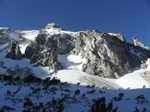

[Blízke Alpy](alpy__blizke_alpy__vt.md)

[Schneeberg, Rax, Hohe Wand, Schnee Alpen, Veitsch Alpen,Peilstein](alpy__blizke_alpy__vt.md)

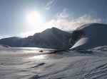

Blízke Alpy_II

Hochschwab, Oetscher, Eisenetzer Ennstaler, Rottemanner T.

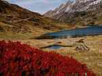

**Schladminger T. Radstadter T. Dachstein**

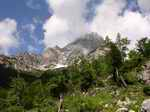

[Totes Gebirge, Hochkönig,](alpy__totes_hochkonig__vt.md)

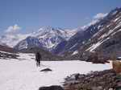

[Hohe Tauern](alpy__hohe_tauern__vt.md) [Grossglockner, Gr.Wiesbachhorn, Grossvenediger](alpy__hohe_tauern__vt.md)

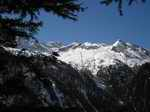

[Ober Tauern](alpy__obere_tauern__vt.md)

[Hochalmspitze, Ankogel Gruppe](alpy__obere_tauern__vt.md)

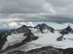

[Stubaier Alpen](alpy__stubai__vt.md)

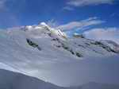

[Zillertaler Alpen](alpy__zillertaler__vt.md)

[Reichen Spitze, Olperer](alpy__zillertaler__vt.md)

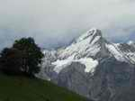

[Berner Alpen](alpy__bernske_alpy__vt.md)

[Eiger, Jungfrau, Monch](alpy__bernske_alpy__vt.md)

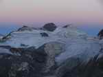

[Engadine Alpen](alpy__bernina_disgrazia__vt.md)

[Bernina,](alpy__bernina_disgrazia__vt.md) [Piz Palu, Monte Disgrazia,](alpy__bernina_disgrazia__vt.md)

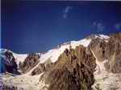

[Mont Blanc](alpy__mont_blanc__2004__vt.md)

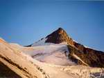

[Nadelhorn](alpy__nadelhorn__vt.md)

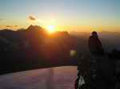

[Dent Blanche](alpy__dent_blanche__vt.md)

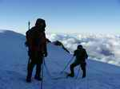

[Monte Rosa](alpy__monte_rosa__vt.md)

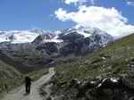

[Ortler Gruppe](alpy__ortler__vt.md)

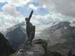

[Presanella](alpy__presanella__vt.md)

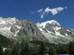

[Grandes Jorasses](alpy__grandes_jorasses__vt.md)
