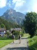
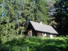
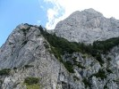

# HorecSport

> Zdroj: http://horecsport.sk/alpy/blizke_alpy_2/alpy_leto_2016/a.html — Wayback snapshot 20220308014408 (https://web.archive.org/web/20220308014408/http://horecsport.sk/alpy/blizke_alpy_2/alpy_leto_2016/a.html)

[HorecSport Home Page](index.md)

**Rakúske leto 2016**

Pred niekoľkými rokmi bola taká doba, keď HorecSport chodil každé leto na týdeň do „ veľkých“ Álp ( pre neznalých našej terminológie, sú to talianske, švajčiarske a francúzske štvortisícky ). No a teraz je pre zmenu taká doba, že „veľké“ Alpy sa zmenili na „malé“ Alpy ( v našej terminológií sú to rakúske trojtisícky ). J

Po „hlbokej“ analýze som dospel k názoru, že v peniazoch to nie je ( veď platy nám všetkým neustále rastú,aspoň tak nám to tvrdia), ale isto je to prirodzeným starnutím obyvateľstva a teda aj HorecSportu. Tak to vyzerá,že v dohľadnej dobe tento problém nevyriešime asi ani my. Tak sa zdá, že Lubo, náš čerstvý päťdesiatnik a jeden zo zakladajúcich členov, pomaly odchádza na horolezecký dôchodok. A Fištrón, naša mladá akvizícia z Čiech a naša horolezecká nádej, sa pre zmenu vydal opačným smerom, zameral sa na zvyšovanie českej populácie. J ( kebyže aspoň slovenskej )

A tak v pondelok zavčas rána, v Horárovom aute sedí iba celé vedenie nášho oddielu a smerujeme na kopček Pfaffenstein. Je to pre nás dobre známa hora, pretože pred časom sa tu Lubo nezmazateľne zapísal do dejín nášho klubu a celého horolezeckého hutia svojím Harapesákom. Tak sme totiž nazvali jeden jeho roznožkový výkrok, o akom sa autorom cesty ani len nesnívalo. J

Hľadanie správnej cesty na parkovisko nám trvá dlho, tak ako minule, ale za pomoci domorodcov sa nám to nakoniec aj podarí. Nástup pod skalu je rovnaký ako v minulosti, ale pre zmenu tu zasa nevieme nájsť prístupový chodník k našej plánovanej lezeckej ceste. Pán Božko nám posiela pomoc v podobe miestneho ferratového borca, ktorý s nami prehodí pár viet a nás aj nasmeruje správnym smerom. Vrcholové číslo komunikácie si nacháva na koniec, keď mi len tak ledabolo položí otázku, či reku máme so sebou aj lano na lezenie. J Asi ho nevidel a ani žiadne naše lezecké náradie ba dokonca ani náš vzhľad ho nepresvedčili o tom, že vieme do čoho chceme ísť. J

Domorodcom ukázaná cesta pod nástup do lezeckej cesty nebola až tak moc príjemná no aj tak, takmer po dvoch hodinách od odchodu z parkoviska, začíname liezť. Pred nami je 11-dĺžková cesta [Sudwandplatten](http://www.bergsteigen.com/klettern/steiermark/hochschwab-gruppe/suedwandplatten-pfaffenstein) na Pfaffenstein. Pestré lezenie, v krásnej južnej stene, s najzaujímavejším miestom na vápencovej vrúbkovanej rampe.

Na vrchu Pfaffensteinu sme o šiestej podvečer a samozrejme ako poslední. Ešte nás čaká čosi vyše hodinový zostup, ktorý si spestrujeme blahodárnou kompletnou očistou v miestnom potôčiku.

Už sa stmieva, keď sadáme do auta. Pre pokročilý čas sa plánovaný odvoz Ivana na najbližšiu vlakovú stanicu odkladá. ( v utorok má byť totiž v robote ). Čaká nás hľadanie nocľažiska. Horár oprašuje spomienky z minula a v podstate s prehľadom nachádza naše ležovisko na zjazdovke. Kým s Ivanom, naťahujeme plachtu proti ranej rose, Horár kuchtí špičkové lečo zo svojich pestovateľských prebytkov.

Ráno sa zvyčajne budíme bez budíka avšak teraz nám vyhráva pred šiestou. Do siedmej totiž musíme prísť na stanicu do Loebenu, aby Ivan nemal absenciu v práci. S trochou stresu to nakoniec s 5 minútovou rezervou zvládame. Ivan smeruje na Slovensko a ja s Horárom riešime, čo ďalej. Upúšťame od nášho pôvodného plánu, 5-ková cesta na Hochalmspitze je teraz priveľké sústo. Po kratšej diskusii, smerujú kolesá Horárovho auta do nám dobre známej vápencovej oblasti Grazer Bergland, pri dedinke Tyrnau. Po deviatej hodine parkujeme na parkovisku pod Rote Wand. Nástup k lezeckej ceste [Effengarten](http://www.grazer-bergland.at/klettern/grazer-bergland/roethelstein-sued/so-sporn/elfengarten-00153/) by mal byť krátky a ani obtiažnosť cesty nie je veľká ( 5- ) a tak si doprajeme pohodové raňajky.

Začiatok cesty je nám známy z minula ale časom zisťujeme, že z tejto strany to asi nie je až tak navštevovaná cesta. Strácame chodník a nakoniec k nástupu musíme aj zlaňovať. J Samotná lezecká cesta je pohodová, bezproblemová. Netrvá ani 2 hodiny a už zobúvame aj lezečky. Ešte pol hodinu dolu kopcom a sme pri aute. Trochu si tu hovieme. Z rôznych túr sa pomaly vracajú lezci a turisti. My sa zabávame na ich výrazoch v tvárach, keďže keď odchádzali, my sme sedeli pri aute a teraz, keď sa vrátili my už zasa (alebo ešte )sedíme pri aute. Údiv a či prekvapenieje v ich tvárach jednoznačný.

Dnes nás ešte čaká cesta na koniec doliny rieky Malta. Na parkovisko pri priehrade Kolnbreinspere prichádzame opäť za šera, takže nemáme ani čas a ani sily niečo riešit a tak tu aj večeriame ba aj spíme.

Vstávame po šiestej a o pol siedmej, po letmých raňajkách odchádzame. Prejde desať minút a Horár sa „prebúdza“ a vracia sa prehľadávat auto, rád by si zobral aj svoje slnečné okuliarky J. Pokus to bol však nevydarený. Putovanie okolo priehrady bolo vydarené a tak po ôsmej hodine sme na Osnabrucke hutte. Dopĺňame tekutiny a po deviatej vyrážame smer [Ankogel](http://www.bergfex.at/sommer/kaernten/touren/wanderung/8987,ankogel-von-der-osnabruecker-huette/). Chodník vedie popri krásnom vodopáde a následne stúpame trávnato-skalnými terasami. O jedenástej si pripíname mačky a nie príliš komplikovaným ľadovcom stúpame smerom k skalnému hrebeňu.

Trochu ľahkého dvojkového lezenia v skale a o 13 hodine sme na vrchole. Počasie je výborné, dobrá viditeľnosť a všade dookola samé hory. Nádherné hory. Fascinujúca je západná strana Hochalmspitze. Ani sa mi veriť nechce, že sme tade pred pár rokmi vystúpili na vrchol Hochalmspitze.

Na chatu sa vraciame po našej výstupovej trase a o piatej podvečer už sedíme na terase, dopĺňame vitamíny kategórie B a konečne podvečer aj obedujeme. Odtiaľto je prekrásny výhľad na Hochalmspitze. Ešte podvečerná prechádzka okolo priehradného jazera k autu a Horár už za tmy šoféruje auto smerom dole k ústiu doliny. Spíme pri aute na trávičke pod nebom plným jagavých hviezd. Paráda.

Dušan
