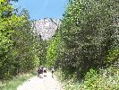
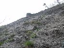
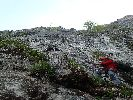

# HorecSport

> Zdroj: http://horecsport.sk/alpy/blizke_alpy_2/rote_wand_2015/vt.html — Wayback snapshot 20210308125504 (https://web.archive.org/web/20210308125504/http://horecsport.sk/alpy/blizke_alpy_2/rote_wand_2015/vt.html)

[HorecSport Home Page](index.md)

**Rote Wand**

Grazer Bergland

Naše dohodobo plánované konco-aprílové ukončenie zimnej lezeckej sezóny v Tatrách sme museli odložiť z viacerých dôvodov. Namiesto toho, dva týždne nato, smerujú kolesá našich áut do Rakúska. Na zahájenie skalnej lezeckej sezóny. Je celkom dobrá predpoveď počasia na predľžený víkend a tak vyrážame smer Grazer Bergland. Nakoľko miestne vápencové skaly ponúkajú aj 8-dľžkové cesty, je to pomerne časté miesto našich skalno-lezeckých aktivít.

V piatok ráno teda vyráža, netradične dvoj-autová zostava, týmto smerom. Nielen počet áut je nezvyčajný, ale aj medzinárodné, česko-slovenské zloženie je neobvyklé. Českú posádku tvoria naši kamaráti Fištrón, Jendo nováčik v zostave - Jendov brat Míra. Slovenskú tvorí stabilná horecsportová zostava - Horár, Ivan a ja. Ďaľším neobvyklým prvkom na tejto akcii je skutočnosť, že okrem lezeckej sekcie máme tentokrát aj turistickú. Tvorí ju bratské duo, Jenda a Míra.

Tetoraz máme na pláne navštíviť doteraz nami nepoznanú, lezeckú oblasť Rote Wand. Na parkovisku pod horou volíme cestu [Waschrumpel](http://www.grazer-bergland.at/klettern/grazer-bergland/rote-wand/hauptwand/waschrumpel-00013/) Je to 7 dĺžková cesta, obtiažnosti 6-. Pod nástup ideme všetci spolu. Priamo pod skalou sa lezecká divízia chystá na lezenie a naši turisti pokračujú ďalej. Plánujú absolvovať okružnú trasu okolo celej oblasti, s výstupom na najvyšší kopec. Čo sa týka nás, v tejto lezeckej zostave klasicky prvú dvojku tvorím s Horárom ja, v druhej je Ivan s Fištrónom. Veľmi pekná lezecká cesta nám niektorým dáva aj zabrať. Všetci cítime, že sme na skale prvý krát po dlhšom čase. Po doleze na vrch sa pokúša Fištrón spojiť s bratskou dvojicou, ale nejako sa mu to nedarí. Keďže turistické duo je nevedno kde, tak naše kroky smerujú do doliny, k autu. Na naše počudovanie, turisti nie sú ani pri aute. Avšak konečne sa nám darí s nimi spojiť a zisťujeme, že oni sú ešte na kopci. Takže máme hodinku k dobru. Za ten čas zistíme, kde je pitná voda, ale zároveň prichádzame aj nato, že tam sa vôbec nemôžeme spať. Musíme isť do Mixnitzu, na naše obvyklé nocľažisko.

Po perfektnom dni sa všetci tešíme na príjemný a pohodový večer pri pivku a hrnci fazule. Blížiacu sa oblačnosť preto ani neberieme vážne. Navyše keď aj metroligický guru, doktor Ilko hovoril, že zrážky majú byť až nasledujúci deň. No príroda sa nielen s ním, ale aj s nami pekne zahrala. Sotva sme sa stihli rozkukať, začína pršať. V očakávaní krátkej prehánky robíme provizórny celtový prístrešok pri aute. Z provizórneho sa stáva nakoniec bohužial trvalý a večer trávime v polostoji s údenými špecialitami v jednej a pivom v druhej ruke. Dokonca aj naše nocľažisko staviame za dažda, ale takúto činnosť už máme dostatočne natrénovanú a už sme ju zvládli aj horších podmienkach. J

V sobotu sa lezecká časť týmu vracia k Rote Wand a naši turisti majú na pláne roklinu **Bärenschützklamm.**Nástup pod stenu je podobný ako predchádzajúci deň, avšak mužstvo je po predchádzajúcom dni dosť opotrebované a tak okrem Horára, nikto nejaví špeciálny záujem o skaly. Takýto scénar nie je medzi nami prvý krát. J Aj tak sa však pomaly súkame do sedákov a obúvame si lezečky. Spoza kopca zaznievajú akési delové salvy. Keď sa však za chvíľu zjavia tmavé búrkové mraky, pochopíme, že to nebola oslava konca vojny, ale boli hromy a blesky. Dokonca aj trocha zaprší. Keď je 5 minút bez kvapiek a hromov, Horár sa už aj naväzuje na lano. Trochu skúšam na neho, že kašlime nato a tak. No on sa tvári, že ma nepočuje ( ako obvykle v takejto situácií ) a už je aj v stene. Nič iné mi nezostáva, len istiť ho a následne liezť za ním. Päťková cesta [Huhnerleiter](http://www.bergsteigen.com/sites/default/files/topos/95_Topo_78ca5599-d5eb-43a1-924d-2ea0d98cd9a1_feuervogel.pdf). Druhá dvojka vyhodnotila situáciu s dažďom opačne ako my a naše počínanie v stene sleduje z boku, zo zostupovej cesty. Naštastie nám však počasie praje a tak po prekonani prvotnej nechute sa teším, že Horár sa nedal prehovoriť a išli sme liezť.

Podvečer sa stretáme v Mixnitzi so spokojnou bratskou turistickou dvojkou. My sa vraciame na rodnú slovenskú hrudu a českí kamaráti si predĺžujú pobyt v Rakúsku o noc.

Dušan
