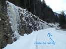
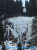
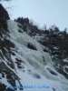

# HorecSport

> Zdroj: http://horecsport.sk/alpy/obere_tauern/maltatal_2013/vt.html — Wayback snapshot 20170303235658 (https://web.archive.org/web/20170303235658/http://horecsport.sk/alpy/obere_tauern/maltatal_2013/vt.html)

[HorecSport Home Page](index.md)

**Maltatal náš obľúbený**

**2.ľadová etapa**

Ankogel gruppe, Austria

V jednu februárové ráno, veľmi skoré ráno, okolo 4,00 si sedím v aute, celý rozospatý sa obzriem vľavo a čo nevidím..vedľa mna sedí čuduj sa svete opäť Horár. Sníva sa mi to? Spím ešte?...neviem.. pomaly som precitol. Nesníva a my sme tušim na ceste do rakúskeho raja ľadových lezcov – do Maltatalu. Je sobota ráno a my valíme, zostava zostáva nemenná aj tentokrát. Ten ujo vedľa mna s veľkým nosom je Horár/ šofér a ten, čo polovicu cestu spí (tiež s velkým nosom ) a pije kávu to som ja..Cestou zistujem, že som zabudol lyžičku – to je ako zabudnúť čakan. Malá zástavka, chybička odstránená..:)

V Tatrách je cesta zarúbaná nuž Malta. Tam hlásia miestni lezci výborné podmienky. Cesta je dlhá primerane – už sme si zvykli, vypili sme liter kávy cestou.. veď čo budeme, pohodu si spravíme aj v aute. Blížime sa, snehu málo.. ideme bližšie a už je to tu, srdce sa rozbúšilo.., vľavo hore od cesty nás vítajú krásne vytečené ľady, potom ďalší a ďalší.. Pri maut rampe nasaduzujeme reťaze naučenou technikou a hurá do krajiny ľadu a riadnej zimy.. Parkujeme pri Gmunder hutte. Ďalší priebeh činností sú všetko naučené pohyby, keď sa človek prezlieka a raňajkuje pri -10 vonku, musia to byť všetko rýchle, účelné pohyby.. nejedení, veci v batohoch rozdelené, materiál, laná – ide sa na vec.

Dnes ideme na ľad, ktorý má docela dlhý nástup, ale operujeme s tým, že keď už sme došli takto neskôr, tak bude dosť lezcov už v akcíí, tým pádom volíme alternatívu, kde je pravdepodobnosť hustoty lezúňov menšia. Ľadu je všade kam sa obzriem dostatok, sme tu tretí krát, ale také podmienky tušim ešte neboli.. Naše kroky vedú do Keesbachfall 3-4 /90m - to je vrchná hlavná časť, tam sa dostávame hravo po vymrznutom sneho ľadovom žľabe. Lezenie perfiš – nad nami jedna dvojka, ktorá končí a my zostávame sami..ľad je tvrdý ako kameň, ale vo vrchnej časti si už zvykáme a ide to ako po masle, pasia, nozaj sa tým bavíme, sme rozlezení s Tatier.

K autu sa vraciame potme. Ubytko máme rezervované v zrubovom domku v doline. Aj tu sme sami..len kúrenie ktosi odstavil a noc je naozaj chladná – predpokladám okolo 15 pod nulou

J

Ranajky ako sa patrí – 2-3 chodové, kávička musí byť, je nedeľa ráno, krásne slnečné ráno. Fičíme na rozlez do Hochalmfall 3/80m, sú tu akýsi cirkusanti – ale nie, veď to sú taliansky alpinisti, kriku všade naokolo, ako keby ich bol celý autobus, ale sú len štyria. Naštasie pod nami, dole zlaňujeme, je nedeľa obed a je tu fakt kosa. A v tom Ivuško zahlási.“ Poďme na kávu“. Mlčky hodím ťažký batoh s materiálom pod prvú borovicu a ideme k autu, ku chate..dymí sa z komína a my sa o pár minút oddávame dúškom horúcej kávy.. Príjemná siesta. Zajeme nejaké sladkosti a ideme fárať na poobednú šichtu. Smer? Jasný! Už sa uvoľnil Voreder Maralmfall 4+/90m. Uplná krása, je neskoré poobedie, mráz silnie a my sa blížime k tejto ľadovej kolmej ozrute. Ivuško napriek pokročilému času navrhuje to zobrať našim variantom z úplného spodku, takže žiadna výpomoc šikmou rampou. Sme tu sami, všetko výborne odsýpa a nás to baví... zlaňujeme za šera... cestou k autu je ticho... každý z nás spracováva pocity, ktoré zažíva keď lezie, keď je tu v skratke taká pohoda, aká práve panuje... je to príjemné ticho, ktoré prerušuje vrzgajúci sneh pod nohami... teraz je už tma. Dnešný nocľah si vylepšujeme o jednu hviezdičkuJ. Večer opäť naučené činnosti..čaj, polievka, večera, čaj, slivka... teplý spacák, slivka dobrú noc..

Pondelok ráno. Zamračené. Zima ako v psinci. Čaj, káva, raňajky, únava, zamrznuté veci, tvrdé topánky, zamrznuté šošovky, zapuchnuté prsty na rukách, popraskané pery, odretý nos, dobité kolená, tušim mam seknuté aj v krku. Ok, tak ideme na ten najťažší ľad. Je to tak 45min od auta. Zima a náš stvrdnutý stav na rozkazuje utekať..tak bežíme! My bežíme pod ľad! Ako nedočkaví bojovníci..to je v prdeli. V našich rokoch bežíme aj s materiálom na chrbte pod ľad.. Dnes totiž Wintasun 4+/160m. Drina – od začiatku do konca. Prvý štand visím vo vzduchu a istím Horára, trošku diskomfort na tom koreniJ. Ivuško je terminátor, nezaváhal, ja len opakujem ako papagáj - ale docela mi to ide. Hore ešte uvoľnujeme lano dvom Maďarom, lano, ktoré sa im seklo. Nebyť nás, tak ani sezónu na balatóne nestihnú.: )

Sadáme do auta, zástavka v miestnej krčme so štamgastami. Všetci tam boli, keď sme vstúpili. Na veľkých terénnych pickupoch a traktoroch s reťazami. Všetci miestni horali, lesáci, drevorubači.,červené vyfúkané tváre prezrádzali ich krvnú skupinu. Všetci s pivom v ruke a šnapsom pred sebou. Všupili sme bez strachu a bázne do krčmy a nastalo ako vo filme ticho a všetky pohľady sa upierali na nás a prevrtávali nás ako guľka preletí vankúšom. Zrak upierajú na nás aj miestni kartári – hrobové ticho v nafajčenej miestnosti preruší jeden z nich, ktorý chcel akurát máchnuť rukou a vraziť silou do dubového stola s kartou v ruke, asi dôležitou kartou..možno víťaznou...pozrel sa mi do očí a skríkol miestnym prízvukom „ejskleta“? Usmial som sa nesmelo kyvnem hlavou a vravím „naa sicha“. A viem, že toto bola naša víťazná karta...kartár s cigou v ústach dôležito kývne hlavou nadol. Sme prijatí, ruch v krčme pokračuje a už nikto na nás tak nečumí. Sadáme si a k nám letí krčmárka usmiata od ucha k uchu.. Naše tváre nás prezradili.. Povedal by som, že sme zapadli do koloritu a kľudne by som tam zostal aj do rána, ale občas treba aj do roboty nakŕknuť..

Ivík
