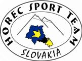
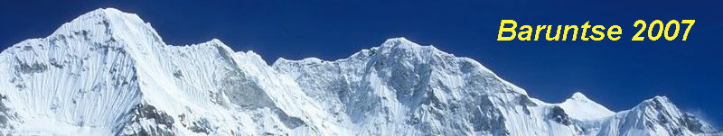

# Himalaje Baruntse

> Zdroj: http://horecsport.sk/himalaje/baruntse/himalaje_main.html — Wayback snapshot 20210308125810 (https://web.archive.org/web/20210308125810/http://horecsport.sk/himalaje/baruntse/himalaje_main.html)

[HorecSport](index.md) | [Úvod](https://web.archive.org/web/2023/http://horecsport.sk/himalaje/baruntse/himalaje_uvod.html) | [Účastníci expedície](https://web.archive.org/web/2023/http://horecsport.sk/himalaje/baruntse/himalaje_ucastnici.html) | [Trasa](https://web.archive.org/web/2023/http://horecsport.sk/himalaje/baruntse/himalaje_trasa.html) [expedície](https://web.archive.org/web/2023/http://horecsport.sk/himalaje/baruntse/himalaje_trasa.html) | [Fotogaléria](https://web.archive.org/web/2023/http://horecsport.sk/himalaje/baruntse/fotogaleria/vt.htm) | [Popis akcie](https://web.archive.org/web/2023/http://horecsport.sk/himalaje/baruntse/himalaje_popis.html)

**Baruntse** je 7129m vysoká hora nachádzajúca sa vo východnom Nepále medzi Everestom a Makalu. Je to symetrický snehový vrch, ma štyri hrebene a štyri vrcholy. Na východe je ohraničený Barunským ľadovcom, na juhu Hunku ľadopádom. Na severo-západe je to ľadovec Imja. Tri hlavné hrebene sú situované medzi týmito ľadovcami. Ďaľšie známe vrchy z tejto oblasti sú Chamlang, Ama Dablam, Pumori a trekingový vrch Mera Peak.

Vrchol Baruntse bol prvýkrát dosiahnutý 30. mája 1954 členmi novozélandskej expedície sira Edmunda Hilaryho. Na vrch vystúpili juho-východným hrebeňom.

**Cesta juhovýhodným hrebeňom** - priamočiare lezenie, väčšinou snehom, ale vo vysokých výškach ju križuje niekoľko ľadových stupňov so sklonom do 50° s najťažším ľadom vo výške 7000m. V spodnej časti trasy je menšie riziko lavín, úseky v hornej časti môžu byť s prevejmi.

**Sponzori**

**Mediálny partner**

