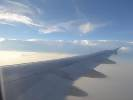
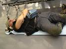
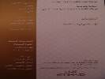

# HorecSport

> Zdroj: http://horecsport.sk/himalaje/island_peak/vt.htm — Wayback snapshot 20220129090921 (https://web.archive.org/web/20220129090921/http://horecsport.sk/himalaje/island_peak/vt.htm)

[HorecSport Home Page](https://web.archive.org/web/2023/http://horecsport.sk/himalaje/index.html)

**Island Peak 6189m**

**Himaláje, jar 2013**

No. Tak som si opäť „trochu“ zasprievodcoval...tentokrát v Nepále..hmm pekné to tam majú chlapci nepálski a môžem povedať, že mnohé sa zmenilo za tých 6rokov, čo som tam nebol. Neviem, či k lepšiemu alebo k horšiemu, každopádne zmenu som zaregistroval. Mobil má už každý Nepálec v Kathmandu a každý druhý trekujúci, nosiaci tovar či materiál priamo v srdci Himalájí. Pred 6 rokmi to tak nebolo.., ale nebola ani taká dobrá strava, bola skromnejšia, teraz sa prispôsobujú požiadavkám západného sveta, ale musím povedať, že tá súčasná strava je rovnako vynikajúca ako tá spred pár rokov. A letisko v Lukle? Okupuje čoraz viac vrtulníkov.., ti piloti su naozaj frajeri. A baba v lodge pri letisku v Lukle je rovnako mazaná a drahá (ťažiac zo svojej polohy pri letisku) ako kedysi.. po chodníkoch už nezastavujú komunisti a nepýtajú poplatky, ale tých výberčích moc neubudlo.. tak ich obchádzam, lebo ani neviem prečo furt niečo platiť, kedže vstup do parku som už platil.. tak neplatím, obchádzam a im to nevadí, veď príde zase niekto, kto platiť bude.., aj po chodníkoch je viac občerstvovacích miest s väčšou ponukou ako bývala.., viac turistov, horolezcov. V Dingboche sedím na pive s Peťom Hámorom- skvelý chlapík, vie čo rozpráva, ja čo počúvam.. v rovnakom mieste berie vrtulník jedny zavodnené pľúca do KTM.. žijú, full service v základnom tábore, vynikajúce jedlo, čaj, káva.

V Kathmandu sa ponuka pív moc nezmenila – prioritne Tuborg/Everest fľaškové, necítiť hašiš, nenašiel som šúlané eukalyptové cigarky, ale zato som našiel na hoteli dosť urastených „rusov“, pri zašlapnutí vždy pleskly, na toaletách sa dajú robiť dve činnosti naraz – aj sedieť aj sa pri tom sprchovať, predavačka sa ma opýtala prečo som taký opálený – bledunká baba, smog v KTM bol horší ako kedysi, zjednávať ceny sa dá furt, holič ma pri stríhaní trochu porezal a súčasne pozeral seriál v TV, potom ma úctivo obtiahol, na letisku v KTM smerom do Lukly pretrváva neskutočný chaos a rupie trhajú z cudzinca všetci..cetou späť zase všetci trasieme, či sa vojdeme do lietadielka.. vošli sme sa, opice v opičom chráme sú rovnako sprosté ako boli, mrtvoly sa spaľujú stále..náreky, horko, smrad, okrádači mrtvol všetko ako bolo.. tu zacítim v istom momente haš.. neskutočné horko 39st, spím ako zabitý na izbe a večer sa ponevieram ako bezduchý po hotelovej terase s Everestom v ruke, na hotelovej street je samí šijací stroj, oblievajú cestu vodou aby sa neprášilo pretiahnem sa po nej do krčmy, tu si dám chili kura a moje pery už aj tak spálené od slnka si nevedia „vynachváliť“, ešte mesiac po príchode domov ich ratujem krémikom J, ranajšie ospalé Kathmandu, ticho v smradľavých uliciach, v rannom opare, prachu leží zopár žobrákov a čakajú na niečo, ale...čakajú vôbec na niečo?.., nepitná voda, ovocie na predaj, ktoré vás uväzní do dvojdnových kŕčov, lacné perovky, spacáky, tigria masť na rohu, nejaký druh polície večer vyskáče z auta- asi 20ks s palicami v ruke a ide robiť do Thamelu poriadky, mnoho mladých v ulicach, mladá asi 16ročná Thajčanka ma zastaví, že či niečo alebo nič, hovorím nič, som unavený,furt neprší, horko, moc nevnímam, už chcem sedieť v lietale cestou domov..sedím,odporné lietadlové jedlo, ale dobrý divoký Django v TV, sedím aj v Abu Dhabi na letisku.., už ma neobsluhuje krásna Slovenka-letuška, ktorá mi nalievala whisky cestou do nepalu a volala ma na kus rečí..., Frankrurt, Viedeň,..BA – tu zmoknem do nitky, nevadí mi to...idem spať a spím a skoro 2 týždne v kuse, únava, únava z ľudí je tá najúnavnejšia únava akú som kedy zažil...

Ale v kopcoch, v kopcoch to bolo krásne, rád sa vrátim opäť, ten život na kopci, v tábore..chcem to zase

Ivík
