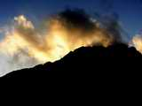
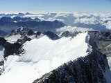
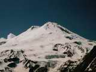
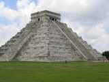
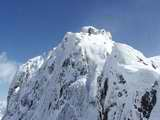

# Občianske združenie Horec Sport

> Zdroj: http://horecsport.sk/index_files/mainmenu.htm — Wayback snapshot 20080611024842 (https://web.archive.org/web/20080611024842/http://horecsport.sk/index_files/mainmenu.htm)

[Slovensko Nové](slovenske_hory__slovenske_hory.md)!!

[Počasie](http://www.wetter.at/) a podmienky na Slovensku

[Aktuálne počasie (SHMU)](http://www.shmu.sk/?page=62)

[Aktuálne počasie na horách (HZS)](http://www.hzs.sk/info/pocasieprehlad.php)

[Predpoveď počasia (SHMU)](http://www.shmu.sk/?page=100)

[Predpoveď počasia (Meteo)](http://www.meteo.sk/)

[Predpoveď počasia pre hory (HZS)](http://www.hzs.sk/info/predpovedprehlad.php)

[Predpoveď počasia pre Vysoké Tatry](http://www.shmu.sk/?page=107)

[Lezecké, turistické a skialpové podmienky](http://www.hzs.sk/info/podmienkyprehlad.php)

[Lavínová situácia (HZS)](http://www.hzs.sk/info/lavinyprehlad.php)

[Vývoj lavínovej situácie (HZS)](http://www.hzs.sk/info/lavinyprehladgrafy.php)

[Výstrahy pre jednotlivé pohoria (HZS)](http://www.hzs.sk/info/vystrahyprehlad.php)

**Počasie vo svete**

[Rakúsko](http://www.wetter.at/)

[Švajčiarsko](http://www.meteoschweiz.ch/web/de.html)

[Taliansko](http://www.meteo.it/)

[Francúzsko](http://www.meteo.fr)

[Europa](http://www.wetter.at/international/europa)

[Svet-CNN](http://edition.cnn.com/WEATHER/)

**Webkamery - krajiny**

[Slovensko - galéria webkamier](http://www.holidayinfo.sk/sk-sk/gallery/)

[Česko - galéria webkamier](http://www.holidayinfo.cz/kamery.php?lang=1&rg=0)

[Rakúsko](http://www.panoramablick.com/index.php?kat_id=1&nav_id=1&cam_id=320&lang=de&action=showkat&lang=de)

[Švajčiarsko](http://www.panoramablick.com/index.php?nav_id=230&kat_id=230&cam_id=356&action=showkat&lang=de)

Europa

[Svet](http://www.camscape.com)

**Webkamery - vrchy**

[Slovensko - Lomnický štít](http://www.holidayinfo.sk/sk-sk/gallery/?id=473)

[Slovensko -Štrbské Pleso](http://www.holidayinfo.sk/sk-sk/gallery/?id=465)

[Slovensko - Chopok](http://meteo.profinet.sk/webcams/chopok-chata.jpg)

[Rakúsko - Grossglockner](http://www.glocknerblick.com/)

[Rakúsko - Rax](http://www.wetterpanorama.at/niederoesterreich/rax/iframe.htm)

[Švajčiarsko - Matterhorn](http://bergbahnen.zermatt.ch/d/web-cam/zermatt4.html?1)

Švajčiarsko - Eiger

[Francúzsko - Mont Blanc](http://www.webcam-montblanc.com/webcam/)

[Taliansko - Ortler](http://www.downloadservices.net/sulden/livecam.jpg)

[Japonsko - Fuji](http://camera.city.fujiyoshida.yamanashi.jp/-wvhttp-01-/GetStillImage?p=-7&t=9&zoom=3000)

[Alpy Fotogaléria](alpy__alpy.md)

[Himaláje](himalaje__baruntse__himalaje_main.md) [Nové!!](himalaje__baruntse__himalaje_main.md)

[Kaukaz](kaukaz__kaukaz.md) [Fotogaléria](kaukaz__kaukaz.md) +Text

[México](mexico__mexico.md) [Fotogaléria](mexico__mexico.md) [+Text](mexico__mexico.md)

[Rumunsko](rumunsko__retezat__0.md) [Fotogaléria](rumunsko__retezat__0.md) +Text
