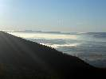
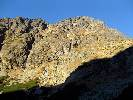
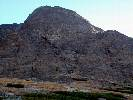

# HorecSport

> Zdroj: http://horecsport.sk/slovenske_hory/vysoke_tatry/akcie/babie_leto_2012/vt.htm — Wayback snapshot 20170304054213 (https://web.archive.org/web/20170304054213/http://horecsport.sk/slovenske_hory/vysoke_tatry/akcie/babie_leto_2012/vt.htm)

[HorecSport Home Page](index.md)

**Babí léto**

**Vysoké Tatry 2012**

Už je to nějaký čas, co se mi naposledy podařilo s chlapci vyrazit někam vysoko. Popravdě musím říct, že je tomu bezmála půlrok. Spousta věcí se za tu dobu odehrála, spousta věcí se změnila... Důležité ale je, že hory stále stojí a naše krásná zemička se pořád ještě otáčí podle svých vlastních vesmírných pravidel.

Dokonce snad i naše přátelství neutrpělo velké újmy, i když jsem si svojí půlroční absenci patřičně

zodpovídal před celou klubovou radou. Spláchla to až Ivánkova pálenka a pot a prach našich milovaných hor.

Je úterý šestnáctého října a mně konečně přichází už tak dlouho očekávaná zpráva.

„chlapci ja na vašom mieste by som počítal s tým, že vo štvrtok navečer padáme do tatier..

teda ak vydrží predpoved počasia. Ivan.“

Netrvá to ani minutu a já jsem rozhodnutý. Tohle si nenechám ujít ani za zlatý prase!

Okamžitě se zvedám od počítače a přebíhám do vedlejší kanceláře s prosíkem o dovolenou.

Dostávám zelenou, teď už mě nic nezastaví! Celou středu se modlím k bohům hor, ať vyjde počasí.

Naposledy přecházím meteo servery v odpoledních hodinách. Hlásí stabilní a pěkné počasí minimálně na tři dny. To musí být konečně ono. „To je to naše každoroční Babí léto“, šeptám si tiše pod vousy, abych to nezakřikl a oči mi září jako malému klukovi...

Vyrážím ve čtvrtek odpoledne po práci. Poprvé si sebou pro jistotu nevezu žádnou kořalku. Je čerstvě po prohibici a chlapci mě už dopředu varovali, že by chtěli ty svoje hory ještě alespoň jednou vidět. Což docela chápu. Navíc by to bylo stejně jen vození dříví do lesa. Po tom, co má letos jeden nejmenovaný klubista napáleno, bych se jen ztrapnil!

S Ivanem mám, jako už tradičně sraz na jeho chatě na Zelené vodě. Dorážím pozdě, zasekal jsem se v koloně na brněnské dálnici (jak jinak..).

Vítá mě voňavou kávou. Nastrkáme jeho obrovské lodní vaky s materiálem do mé malé fábie a vyrážíme na noční jízdu.

Do Tater dorážíme okolo jedenácté hodiny v noci. Ubytujeme se v Ivánkově novém „doma“ a je nám dobře. „Má to tu chlapec ale krásné“, přemítám si u flašky piva a jsem rád, že ho zase vidím. Trochu se picneme, ale dlouho neponocujeme. Hory už nás čekají!

Ráno vstáváme, jako správní alpinisté. Na půl devátou a úplně oteklý. Zas tak málo toho včera asi nebylo... No co, dlouho jsme se neviděli. Navíc mi chce kamarád dnes ukázat okolí svého nového bydliště, dopravu, potraviny, koliby a jiné nejrůznější vychytávky. Na to máme ale ještě celý den.

A tak v klidu posnídáme. Električkou se přesouváme do Smokovce a odtud dále do Lomnice.

Náš dnešní cíl je velmi skromný. Lanovkou na Skalnaté pleso a odtud pěšo pod Lomničák. Tam si lehneme pod nástup lezeckých cest a Ivuška mi dává přednášku o co všechno jsem přišel, když jsem s nimi minule nebyl. Musím přiznat, že mě to fakt sere. Ale opravdu jsem nemohl!

Nedá se nic dělat, snad příště. Uleháme tedy alespoň do suché trávy mezi balvany a trochu si schrupneme. Kolem nás se pasou kamzíci. Jak harmonické...

Probudí nás, až nepříjemný stín. To se jen slunce přehouplo přes Lomnický hřeben a šlo se podívat do Malé studené doliny. Rychle pelášíme na pivo na skalnaté. Odtud dále kolem chaty Laca Kulangy a chodníkem na Zámku. Tu ale raději obcházíme pasekou jako prašiví psi a mizíme nosičskou zkratkou v lese. Je to naše nejoblíbenější chata a tak jsme si moc dobře vědomi, jak bychom dnes zase skončili! Na Hrebienku dostáváme blbý nápad a půjčujeme si za čtyři eura od místních vydřiduchů koloběžky. Litujeme toho asi ještě dvě hodiny! Vyhodili jsme čtyři piva oknem. Ve Smokovci ještě vyzvedneme obrazy jednoho místního fotografa, které si můj kamarád objednal, a s první električkou uháníme k domovu. Krásný den zakončíme polévkou a pivkem v kolibě za domem. Večer odpočíváme v křesle. Ještě dnes v noci dorazí Dušan s Horárem. Čekání na

ně si krátíme dlouhými rozhovory o našem bytí. Však jsme se dlouho neviděli...

Chlapci doráží okolo jedenácté. Přivítáme je žejdlíkem piva a malou štamprlí. Chvilku posedíme, naplánujeme co s lezením a jdeme na kutě. Plán udal Horár.

Ráno o sedmé nás vyzvedne na parkovišti Tatranská Polianka jeho známá a odveze nás na Sliezsky dom do Velické doliny.

Náš dnešní cíl je Velická stěna. Cesta s názvem „Cez výlom (IV,V) 3h„. V klidu stoupáme chodníkem, nikam nekvaltujeme. Čekáme, až slunce olíže ty krásné plotny a trochu nám to připraví. Z Plošiny pod západní stěnou vstupujeme do žlabu a pomalu nenavázaní stoupáme vzhůru k nástupu. Přeběhneme pár travnatých lávek a jsme u zlatého nýtu. Nástupní místo Sedielko. Lezeme ve dvou dvojkách. První Horár-Predseda, druhá Ivánek a já.

Lezení je krásné v pevné skále, štandy jsou bezpečné, osazeny nýty od Tatarky. Slunce nám dává sílu. Obloha je tmavě modrá, bez jediného mráčku. Tohle prostě nemá chybu! Hltám každý metr a je mi dobře… Vše jde jako po másle a z ničeho nic je tu vrchol. „Škoda, že to nemá ještě pár set metrů“, říkám svému parťákovi a on jen s přiblblým úsměvem souhlasně přikyvuje.

Na vrcholku se nějaký čas povalujeme jako vepři. „Máš v p..i Špagi“!

Z vrcholu sestupujeme do travnatého sedla směrem k Dvojitej veži na Granátovú lávku. Tam máme na výběr dvě možnosti. Doleva strmým kotlem, anebo doprava pod Velicků kopu. Všechny nás to táhne spíše doprava, a tak je rozhodnuto. Přebíháme tedy pod Velickú kopu a dál až na její konec. Potom prudce dolů žlabem až na turistický chodník vedoucí z Hrebienka na Sliezsky dom.

Ještě pár kroků a sedíme v klubu horských vůdců za Sliezskym u velkého krbu a pijeme Kozlíka.

Barman plně reprezentuje své bratislavské kořeny. A tak vůni pryskyřice z praskajícího dřeva různě prokládá odérem škvařícího se polystyrenu a igelitových pytlů, jejímž přikládáním si krátí dlouhou chvilku a tím i šetrně recykluje odpadové hospodářství tak „malebného“ hotelu.

Po pár pivkách mizíme. Ti silní pěšo a ti méně zdatní kolmo. Večer zakončíme oslavou hned dvou narozenin v kolibě za domem. Narozenin těch samých náčelníků jako minulý rok v oblasti Pelsteine v Rakousku. Uteklo to chlapci, už jste zase o rok starší:).

Je neděle ráno a nám se nevstává zrovna lehce. Napraví to až ranní káva a chleba s vepřovkou.

Jelikož máme ještě roupy, bavíme se co dále. A plán udává??? No přece Horár. “Kubínove rebro chlapci, hřebenovka. Čo vy na to?“ Není to prý moc daleko, kousek do Mlynické doliny. Nad vodopádem skok a plesem nad skokom doleva sutí pod hřeben. Pak po ostrém žebru asi tři hoďky na vrchol Mlynického Soliska. Z vrcholu sjezd sutí na Sivou lávku a z ní další sjezd zpět do Mlynickej doliny.

Jasně že se necháme zlákat!

Nástup nakonec není zas tak kraťoučký. A jelikož jdeme na věc ve třech, ani samotné lezení není za tři hodiny. A proč ve třech? No, trošku jsme podcenili úklid bytu, a tak zůstal náš hostitel ve štychu. To od nás ale vůbec nebylo hezké! Chudák se obětoval, aby uklidil bordel po kamarádech, zatímco oni si lezou a opalují se na slunci. Je to ale charakter!

Budeme s tím muset na příště něco udělat...

Ale zpět k samotné akci. Hřeben je mnohem delší, než na první pohled vypadá. Snažíme se postupovat rychle, ale jsme tří. Místy je žebro pěkně špičaté, tudíž i expozice stojí za to. Má to být trojkové lezení, ale díky Horárově přímočarosti se místy pohybujeme spíše na stupni pět, řekl bych. Neustupuje totiž, není li to nezbytně nutné, ani doprava ani doleva. Mastí si to nekompromisně po hřebeni, jak po ostří šavle. Samotné lezení nám zabralo asi čtyři hodiny. Na vrcholu se dnes válet bohužel nebudeme. Je půl čtvrté odpoledne a my chvátáme domů. Hlavně Horár musí stihnout ve čtvrt na sedm vlak ze Štrby.

Sjíždíme sutí tak rychle, až to chvilkami nemá mozek pod kontrolou. Naštěstí se nám každé klopýtnutí nakonec podaří vyrovnat a my po hodině a půl stojíme na parkovišti u auta.

Tam už na nás čeká Ivan. Kolena brnkají, ale na duši je pokoj.

Ještě stihneme všichni pivo na Štrbském plese a už je čas se rozloučit.

Horár jede na vlak, předseda ještě zůstává a já s Ivanem uháníme škodověnkou směr Nové Mesto.

Za tři hodiny jsme u Iva na chatě, vyhážeme jeho vaky a stisknutím pravice se opět loučíme. „Doufám, že se tentokrát uvidíme dříve než za půl roku“, přemítám si v duchu. Šlápnu na pedál a mizím ve tmě. Domů dorážím s údery půlnočních zvonů.

Na závěr chci říci jen jedno. Chlapci, bylo mi s Vámi zase dobře...

Fištrón

viacej foto na [Picasaweb-e](https://picasaweb.google.com/dbozon)
