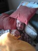
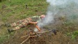
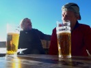

# HorecSport

> Zdroj: http://horecsport.sk/slovenske_hory/vysoke_tatry/akcie/kezmarak_volovka_2015/vt.htm — Wayback snapshot 20220204005751 (https://web.archive.org/web/20220204005751/http://horecsport.sk/slovenske_hory/vysoke_tatry/akcie/kezmarak_volovka_2015/vt.htm)

[HorecSport Home Page](index.md)

**Ako si Duško na Kežmaráku zaplával...**

Ako už tradične úvod môjho článku venujem spomienke na nášho spolulezca a jediného aktívneho radového člena klubu Horecsport, Jiříčka alias Cabadaja alias Candáta alias atď, atď. Chudáčisko celý svet sa spojil proti nemu a on furt bojuje a bojuje. Popri milýchpovinnostiach, ako je výchova svojej Andulky a zahŕňanie láskou svojej manželky Barborky, čelí ešte aj povinnostiam nemilým. Touprvoradou je boj proti svojmu podlomenému zdraviu, ktoré sa verím čoskoro popraví a bude z neho opět náš hezkej silnej klučina z Vysočiny, všetci mu samozrejme držíme palce v tejto chúlostivej tématike a veríme, že čoskoro bude opäť predbiehať srny v hlbokom snehu na bežkách a ešte neraz skríži cestu diviakovi samotárovi a rozdajú si to ako vždy jeden na jedného:-). Tou druhou nemilou udalosťou je boj proti lykožrútom, čo mu napadli les a tak im zachutilo to drevo z jeho lesa, že ho chlapec musel nemalú časť vyrúbať. Kurvy. Tak sa tam náš chlapec musel zožierať a naťahovať s tým drevom sám, nemal čas si ani oddýchnuť ani pospať, práca ťažká to áno, ale všetko zlé je na niečo dobré. Takže to mohol brať ako fasa silový tréning pred blížiacou sa zimnou sezónou. To, aby nám opäť mohol neochvejne tlačiť stopu v hlbokom snehu. A nakoniec by z toho profitoval klub Horecsport ako taký.:) No lenže človek mieni, život mení a Jirko trošku ochorel a snehu zatial napadlo toľko, že stopu pretlačí aj preds.., povedzme menej aktívny jedinec v tejto disciplíne:-) Takže skoré uzdravenie kámo!

Druhú pasáž by som rád venoval nášmu ďalšiemu klubistovi. Nerád to hovorím, ale v súčasnosti po nemilej udalosti, už menej aktívnemu Lubenkovi. Normále nás prišiel podporiť na klubový výlet do Tatier. Teda neviem, čo povedal doma. kam ide..:-) Velice pekné gesto od neho. Dúfam neostane len pri gestách, ale sa aj aktívne zapojí do klubového diania, veď ho čakáme, tak čo. Teda on bol aktívny aj ten víkend, keď nás prišiel pozrieť. Zvŕtal sa v kuchyni ako dokonalá gazdinka, varil, pripravoval, obletoval, zahŕňal dobrotami, ako najlepšie len vedel. A odprevadil nás až k nástupu a dokonca sa aj docela prešiel. Noo verííííme.

Bolo to presne 2.10. Piatok podvečer. A ja čakám čiernu oktávku v NM. Prichádza a jedno miesto patrí mne. Za volantom Predseda, vedľa Horár, vzadu Lubenko a ja. Smer BC Vysoké Tatry. Nejaké to pivečko padne už v aute. Šofér si výnimočne nedal:-). Kričal, že on radšej knihu:-))) Po príchode na byt rozbaľujeme, prebaľlujeme, no medzi tým jeme a pivečkujeme, marhuľujeme a tešíme sa z nastávajúceho víkendu. Idem spať prvý okolo pol jednej do spálne. Opúšťam spoločenskú miestnosť a pohľad po nej mi vraví, že to ešte nekončí. Nekončilo. O pol tretej vnímam ako nejaké vreco zemiakov padá voľným pádom vedľa mňa do postele. Predseda. ufff.

Ráno sa stretnú naše pohľady na chodbe a hovorím si chalanisko tebe bude dnes ešte zle. No, ale Predseda má už naučené zvyky ako si zachovať chladnú hlavu v kritickej situácíí, keďže nejednu už so cťou ustál – čiže okamžite sa presunul k chladničke a šupol hneď jedmo na rovnováhu:-) Ok, mastíme friško do Lomnice na lanovku a na Skalnaté. Tam sme po 8,30. Ale čo to? Bufet už otvorený takže Predsedu bez piva pod stenu už ani buldozér nedostane. Nuž teda pivečko na terase až do chvíle, keď Dušanko vyrečie vetu: „no chlapci ak dám ešte jedno ja osobne idem opačným smerom „, ale ako hovorí náš Candátek „pivo po ránu je ako hnuj na pole“. Tak to bola docela príjemná prestávka. O 10,30 sme pod stenou, no liezť začíname o 11,15 a to sme traja! Natlačíme sa do Birkenmajera. [http://www.tatry.nfo.sk/cesta.php?obr=stity//0294//02940708.p](http://www.tatry.nfo.sk/cesta.php?obr=stity//0294//02940708.p) Lubo sa pod nástupom odpojí a odchádza na Kežmarák, normálkou cez Huncovskú štrbinu. Nuž teda ideme na to, dokonca aj Predseda prehĺta horkú slinu a páše sa do sedáku. Len tie oči... Cesta pekná, skala fajn, pravdupovediac trošku orientačne náročnejšia, ale tak nakoniec trafíme šikmú rampu vedúcu naprieč stenou. Na rampe valíme všetci súčasne, až do chvíle, kedy okolo nás presviští skala ohromnou rýchlosťou, vzápätí druhá. To sa nejakí lezci pred nami rozhodli zlaniť stenu, lebo že sa im nechce šlapať. Druhý však prezradí, že netrafili zostup... Na vrchole sme na podvečer sami, poslední. Sprevádzajú nás len dlhé tiene štítov. Tieň nášho Kežmaráku siaha tušim až niekam do Lendaku. Takže som v jednom okamihu na dvoch miestach. Aj na vrchole Kežmaráku a aj na námestí v Lendaku:) Krása, pohoda, čas odísť dole ešte s akým takým svetlom. Zostupujeme. Blížime sa k Huncovskej štrbine, terén je rozbitý, ja ako vždy pomalšie, chlapci takmer utekajú. Miznú mi za obrovskými skalami a vtom počujem nejaký rušivý lomoz, priam desivý zvuk z miest, kde sú práve parťáci. Do toho rozoznám ešte Horárov krik. Bol to zvuk rútiacich sa skál, ten je pre mňa hrozivejši ako zvuk snehovej lavíny. Pridám do kroku a za rebrom už vidím zbytky zvíreného prachu, cítim síru.. V tom kúdoli prachu stojí ešte stále otrasený predseda, zadok celý spinavý, bunda od prachu, batoh na krivo, ruky čierne, krvavé. Našťastie bez vážnejšej újmy, Horár sledujúc celú udalosť z opodiaľ len neveriacky krúti hlavou a už som zazrel aj prvý úškrn. Potom mi obaja líčia celú príhodu, čo a ako sa stalo. Skrátka pod Duškom sa uvolnila skalná lavína vďaka jeho impulzu – pridŕžal sa skaly a ona sa uvolnila, následne ďalšia a ďalšia až to zobralo aj Predsedu. Ale preto je Predseda predsedom, lebo sa hravo vysporiada aj s takouto nástrahou. Nuž teda Duško neváhal sadol si na kamennú lavínu a ukážkovo na nej plával, síce trochu poodieraný so zvýšeným pulzom, ale živý. Nuž teda pokračujeme trochu vyplašení, stmieva sa, prichádzame do Lievikového kotla, tu nás čaká Lubko s otvoreným pivom. Tak toto áno! Pokračujeme na Skalnaté pleso, prichádzame za úplnej tmy. Posledná lanovka išla dole asi tak pred 2hodinami. Nuž neostáva nič iné ako absolvovať jednu z top nechutných tatranských jebární. Zostup zo Skalnatého do Lomnice. Ideme okolo Lacovej chaty a aha, svetielko. On má otvorené! Neni možné. Nestihnem ani zakričať, čo si myslím o návšteve tohto zariadenia. Len potichu si zašomrem popod nos, že chlapci tak tuto máme jedno pivo tak na hodinku:-). Vchádzame. Vyjednávať prestrčíme Predsedu, predsa len je to vážená osoba. A LACI ho so šarmom, sebe vlastným, posiela do prdele, hahahaha. Ale Duško ho na kolenách poprosíl a Laci nakoniec podvolí i čapuje nám 4 pivá. Asi tak za pol hodku sú načapované v pohároch s nejakým divným nápisom. Náš smäd je už takmer neznesiteľný i každy sa s vervou pustil do svojho vytúženého pivinka. Po prvom glgu sa každý pozrie po každom do očí a opatrne odtiahne pohár od úst. Niekto sa nesmelo spýtal. „Kurva a čo je toto za pivo?“ A Horár v úplnom kľude vyrečie. „Ležiak, leží tu v sklade už nejaký ten rok“. Nuž sa schuti zasmejeme a nerozvážne zasúvame obsah pohárov do seba. Zostup je strááášne nechutný. Cestou dole sa Duško odpojí a akože nás plaší a vydáva zvuky jeleňa v ruji, ktorý nás tak či tak dnes večer všetkých pretiahne:-) Kopec srandy a večer sa už popravíme aj s normálnym pivkom.

Ráno nevstanem. Nedá sa. Nemám nohy. Ani Duško, ani Horár, ani Lubo. Ponevierame sa po BC a hľadáme sa. Hľadáme smer. Nič nenachádzame, ani myšlienku ani nejaký záchytný bod, nápad, nič. Nuž, ale bez nôh sa horolezec len ťažko rozbieha. Tak to nesílime. Je jasné, že na dnes je vymaľované. Po včerajšku si hlavne musíme zregenerovať končatiny. Nuž ideme na kúpeľnú prechádzku po Smokovci a naše kroky vedú až na Biličku, viac nevládzeme. Dobre nám je na terase. Ta fajne. Fajný deň. Škoda, že nevieme o tom, že sa Ria vydáva v neďalekom kostole, ale to by bol už iný príbeh na tento deň:-)

Nedeľa ráno. Vstaneme. Aj ja, ale chlapcom oznamujem, že nejdem, bolí ma ľavá hokejka. Šak dosť. Beriem si deň voľna za odpracované roky v našom klube. Chlapci vyrážajú pod Volovku. Chcú ísť do Stanislawského cesty. A aj idú. [http://www.tatry.nfo.sk/cesta.php?obr=stity//0987//09870804.p](http://www.tatry.nfo.sk/cesta.php?obr=stity//0987//09870804.p) Neďaleko nástupu ležal zabitý jeleň, ale čo tam robil tak vysoko. Asi mu tá ruja fakt udrela do hlavy... Ľubo chlapcov - tak ako minule doprovodil k nástupu. Potom išiel na Rysy na pivo. Túto cestu som v minulosti už liezol s Fištrónkom, tak ma ma to až tak neškrie, že som nemohol, ale škrie:), išiel by som aj dnes. Dnes mali už iné počasie ako predchádzajúce dni, chladno a hmlisto, neskôr poobede sa predsa len vylepšilo. Chlapcom som išiel na Štrbské oproti, nalodil som ich trochu použitých do auta a odviezol domov, nech aj tam z nich čosi majú. Nuž pekný to bol víkend. Pre Duška už posledný tohtoročný na skale.

My sme s Horárom končili sezónu na skale v Rakúsku o dva týždne neskôr na Hohe Wande. Bola to krásne sobota v jesennom šate, slniečko nám svietilo do cesty, ktorej názov neprezradím, lebo ho už neviem, ale našiel som ju ako novú preistenú cestu tušim z roku 2014. Bola za 6 a mala 7 dĺžok. Na vrchole po 2 pivá a hýbáááj dole, kde prichádzame takmer za tmy.

a čakáme na zimu

Ivík
