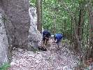
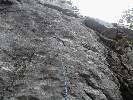
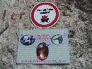

# HorecSport

> Zdroj: http://horecsport.sk/slovenske_hory/vysoke_tatry/akcie/leto_2014/vt.htm — Wayback snapshot 20210308130851 (https://web.archive.org/web/20210308130851/http://horecsport.sk/slovenske_hory/vysoke_tatry/akcie/leto_2014/vt.htm)

[HorecSport Home Page](index.md)

**Leto 2014**

**Vysoké Tatry 2014**

Túto moju správu možno tak pokojne nazvať, k písaniu sa akosi nemá nikto, tak teda opäť ja. Ono toho vlastne až tak moc nebude, lebo v lete-ako už tradične tomu moc nedáme, nad letným lezením prevažujú rodinné dovolenky, výlety so ženami, frajerkami, hlavne sa všetci meníme na záhradkárov a staviteľov. Sekciu záhradkárov tvoria Horár – všetká zelenina, Lubo – všetká zelenina, Predseda – melóny,gruľa, ja – ovocné stromy a všetko čo sa dá pichnúť do suda, posléze vypáliť. Sekciu stavbárov tvorí naš český člen Candátek sám – furt čosi premiestňuje, skladá, buduje, vylepšuje,klubový Bořek stavitel. Aj tu je jasne vidieť ako kvalitne je náš team vyvážený, len škoda, že nie aj vekovo.. V lete je aj tak všade moc ľudí a nerobí nám to moc dobre byť stále v strehu pred letným tatranským turistckým lunaparkom, všade húfy pohľaduchtivých a zážitkochtivých turistov, voňaviek, poobedných búrok,kopec áut, plné parkoviská, plných krčiem a reštaurácíí... Ja osobne som si spestril leto aj sprievodcovaním v Alpách, ale veď vlastne aj Predseda sa bol vyvenčiť v Dolomitoch, Horár v Alpách, Fištrónek v Julských Alpách... no, ale hlavne tie záhradkyJ

Takže na spoločnej akcíí sme boli 2x – na začiatok a na koniec leta. Na začiatku sme boli v rakúskom Mixitzi a na konci v Tatrách.

Dva dni v Mixnitz boli parádne a štvorlístok Predseda, Horár, Fištrón a ja sme sa vracali veľmo spojojný, ale nakoľko je od vtedy už nejaká tá doba, tak si vlastne ani napamätám čo sme to liezli, viem, že prvý deň bola ráno docela zima, naliezli sme do cesty, kde sme sa prerátali a museli sme z nej zlaniť dole, lebo sme nejako vytuhli, potom sme sa však opravili v niečom ľahšom a dlhšom, na druhý deň to bola krásna cesta, kde sme si všetci naozaj z chuti zaliezli a napravili sme si šmak po sobote. Predchádzal tomu ideálny spoločenský večer...

No a pred nedávnom – opäť v tom istom zložení sme sa vybrali na výlet do Tatier, zostava doplnená o posilu z turistickej sekcie – Jendu, vyhláseného to kuchára a fotografa v jednej osobe, môžem potvrdiť, že aj jedno aj druhé mu ide skutočne znamenite. Stretneme sa vo štvrtok večer v BC, ok my (Horár Predseda a ja) normál v normálnom čase, češi(česi) – o polnoci, čiže zase musí byť s nimi kua nejaký problém, nemôžu dojsť nikdy normál, v kľude sa najesť, dať pivko, pomudrovať. Nie dodrbú sa o polnoci. Sráááášne moc toho musia vždy stihnúť na poslednú chvíľu, lebo bez nich je vlastne svet v prd... Spať ideme okolo 1,30.. Ráno budík o 6, raňaječky, kávička musí byť a už aj padáme na prvú hore na Hřebínek. Naše kroky vedú do Malej studenej, dnes je na programe „Cesta k slnku“ na Malý ľadový. [http://www.tatry.nfo.sk/cesta.php?obr=stity//0480//04800710.p](http://www.tatry.nfo.sk/cesta.php?obr=stity//0480//04800710.p) Času dosť sa prebrať, lebo to je na konci doliny, Terynke sa ako povedal večer Horár „z cvičných dôvodov“ vyhýbame J, pokračujeme pod nástup, Jendo ide s nami a v kľude si počká kým odlezieme, potom ide po vlastnej osi cez Sedielko a Javorovú dolinu do Tatr.Javoriny na bus. Trochu zle trafený nástup, ale po 20min je menšia odchýlka vyriešená a my si to mastíme a užívame každý jeden krok v krásnej skale bez nejakého zádrhelu. Lezecké dvojice sú vyriešené už nejaký ten rôčik. Horár s Predsedom a Fištrón + ja. Pri doleze vidím, že Horár šprintuje vľavo po hrebeni, čo znamená, že je zase všetko ináč ako sme sa dohodli pod nástupom, tak sa stretávame na Malom ľadovom, tam požierame gumenných medveďov a hrozienka v čokoláde, potom už len dole do Sedielka. Ešte ako tak sedíme na vrchole tak sa z hmly vynorila postavička – poľka. A za ňou akýsi zmordovaný chlapík- poliak v šlapkách. Úplný pako, teda neviem o čo mu išlo, ale asi sa nestihol prezuť ako došiel z Bibione. Načo provokovať šťastenu.. asi poľská špecialita. Terynu smerom dole opäť obchádzame z už hore uvedených dôvodov – cvičných J. To sa nám však nedarí dole na Zámke, čiže prvé dve sú za nami a hybáááj dole k autu do Smokovca, cestou do BC ešte vytrúbime Jendu sediaceho v kolibe, vzápätí už sa varí plný hrniec dobroty za odborného Jendovho dozoru. Večer nejaké to pivečko pretečie dole trubkami, ale moc nie, lebo únava rozhoduje za nás..a dáva tušiť čo nás bude čakať ráno..

Tieto dlhé nástupy a zostupy... dnes platí dnes už slávny výrok Horára dvojnásob „mužstvo javí známky opotrebenia „ J, žiaľ ano je to tak, vek a únava nezaklopali – zabúchali na dvere bez vyzvania, pomaly veľmi vlažne sa trúsime a motáme po byte, nikto nenachádza správny smer. Iba Predseda. Balí kufre na kolečkách, berie motyku do svalnatých rúk a.... a uháňa do Važca vykopávať vychýrenú gruľu. „Celé detstvo som vyrastal na gruli a haluškách „, zmizol rýchlejšie ako sme stačili zareagovať sediac pri stole sme usrkávali kávičku z roztrasenými rukami. Infúzka by bodla, mužstvo v rozklade..team oslabený o jedného muža. O Predsedu! Čo len s nami bude, kam sa podejeme? DREVENÍK! Zaznie víťazoslávne z Horárových úst. Všetci príjmame toto rozhodnutie ako víťazstvo každého jedného z nás. Lezecká oblasť, nami neprebádaná hneď za Spišským hradom. Po druhej káve sa pomaly vsúvame do auta, šoférujem. O 40min parkujeme pri hrade, odtiaľ 20min a sme pri skalkách, prechádzame cez voňavú lúčku, všade samá borievka..darmo sme na Spiši a tunajšia borovička je delikatesa. Skalky naozaj fajnové, pohodové lezenie, pohodový deň v krásnom prostredí, úplné pohľadenie na duši. Len tú krčmu sme nenašli a to sme aj ďalekohľadom ostrili do dediny.. cestu naspäť do BC prespím.

Večer sa vyberáme z BC dole do obce na čapované pivooooo! Kto nezažil neuverí J. A na ďalší deň domov, do Tatier prichádza dážď. Cestou v aute nás baví 100ročný starček...

Tešíme sa, že prichádza konečne lezecká jeseň, len aby sa to počko konečne polepšilo, no ale šak nejaké okno hadam nájdeme.

Velice vydarená akcia Ivík môj
