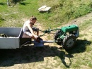
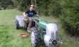
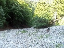

# HorecSport

> Zdroj: http://horecsport.sk/slovenske_hory/vysoke_tatry/akcie/leto_2015/vt.htm — Wayback snapshot 20210308121358 (https://web.archive.org/web/20210308121358/http://horecsport.sk/slovenske_hory/vysoke_tatry/akcie/leto_2015/vt.htm)

[HorecSport Home Page](index.md)

**Leto Horecsportu 2015**

Ako už tradične, v lete lezeniu moc nedáme, lebo sa pomaly ale isto meníme na klub záhradkárov. Aj napriek tomu, ale predsa len boli zaznamenané spočiatku nejaké letmé dotyky so skalou. Tak sa nám to zapáčilo, že sme sa zapozerali najmä do tej tatranskej a nakoniec z toho boli celkom horúce, intenzívne, mnohokrát drsné, náročné, ale zato nezabudnuteľné dotyky, s našou partou rozehratou tralala.. Toto leto sme však absolvovali len v trojici (ale nie po opici), lebo šak náš Jiříček, Candátek, Fištrónek, Cabadaj, Honzo, Pepo, Péťo, Lojzík sa stal v júni roku pána 2015 hrdým otcom Aničky, no a musel ostať zatiaľ doma kojiť J. Občas sa síce dá stretnúť v patinou poznačenej hospode „Na mrtvole“, kde sa vďaka dymovej clone len ťažko orientuje, podobne ako v novembrovej hmle za rannej rosy na žitnom ostrove. Videli ho aj na námestí v Pelhřímově, ako olizuje zmrzlinu malej Andulke. Dokonca som započul, že srny z Vysočiny uskutočnili masový presun do iných, hlukom tak nepostihnutých oblastí, pretože ich neustále atakuje nejaký šialenec na malotraktore Agrostroj Prostějov Pf62 r.v. 1962. Popis zodpovedá na našeho spolulezca (ale to sme v médiách na tlačovke neprezradili) J

Škoda, že nechodí lebo, ako jedinému radovému členovi v našom funkčnom klube, mu prislúcha dôležitá funkcia (okrem iných funkcíí) nosiča materiálu, lán, kozieho syra, hasičkej klobásy a inej výživy, ktorej sa zhostil vervou puntičkárskou, jemu tak vlastnou. Takto sme to museli všetko nosiť my, na naších predsedníckych bedrách, len tie mozole nám zostali.. J. A vek pribúda... V skratke potrebujeme súrne omladiť! No a potom som si spomenul, že ten rozpačitý letný začiatok môžeme pripísať len horúcemu letu, na čo si asi treba zvyknú. A to nám aj teda trvalo. J

**Júl:**to sme sa takto jeden horúci, tuším piatok, vybrali k našim susedom do Rakúska. Najprv po A4 (vtedy sa ešte dalo J), potom po A2 a S6 a došli sme až do obľúbenej lezeckej oblasti Hollental, až na Stadelwand Parkplatz. Tu rýchlosťou dva kroky vpred krok vzad, po strmej šotoline, pod nástup na cestu Neuer Zimmerweg [http://www.bergsteigen.com/klettern/niederoesterreich/rax-schneeberg-gruppe/neuer-zimmerweg](http://www.bergsteigen.com/klettern/niederoesterreich/rax-schneeberg-gruppe/neuer-zimmerweg). Predseda bol ako vždy nezadržateľný a vbehol do nejakého projektu miestnych borcov, čo sme so smiechom okomentovali ako by to dopadlo, že dedinský hasiči nemajú také dlhé rebríky atď atď. J. Srandy kopec na úvod – ono sa to potom lepšie lezie. A to sa aj udialo – liezlo sa nám velice dobre. Napriek tomu horku to išlo fajn, našťastie stála nad každým štandom borovica a ten tieň bol v ten deň ako výhra v lotéríí. Nuž sme tých 10 dĺžok spolkli ako sklenici vody (akoby povedal nezabudnuteľný účetný Fantozzi). Na podvečer sme skočili bez váhania do tyrkysovej vody riečky Schwarza a až toto bol doslova vrchol dňa. Malé občerstvenie, vychladené pivečko sledujúc nejakého športového rybára a potom hajde domov.

**August – začiatok:**to sme sa takto jeden horúci, tuším piatok, vybrali s Horárom do Tatier. V tom pekle sa našlo našťasie nejaké okienko s akože chladnejším počasím. Išli sme len dvojici a opäť nie po opici. Predseda Dušanko v tom čase čeril vodu na francúzskej riviére, obľúbenej to destinácie Belmonda a policajta Funesa v St.Tropez. No a stal sa z neho za ten čas znalec umenia – on má talent snáď na všetko, huncút.

Mali sme na to jeden lezecký deň nuž sme moc nešpekulovali a zvolili sme nie moc dlhý nástup, čiže sme vybrali túru v Žeruchách zo Zeleného plesa. Vtiahlo nás to do cesty „cez knihu“ - [http://www.tatry.nfo.sk/cesta.php?obr=stity//1056//10560715.p](http://www.tatry.nfo.sk/cesta.php?obr=stity//1056//10560715.p). Skala bola parádna, vyhriata, počasie naozaj chladné, v porovnaní s tým, čo bolo pred tým a potom. Medzi nami s Horárom tiež všetko takmer bez slov, každý si užíval tie chvíle v stene, ktoré sme už dlhšiu dobu spoločne nezdielali. No a čítanie v samotnej knihe? Chuťovka. Viac slov je zbytočných. Cestou na chatu nás odchytí akýsi pomätený kamzík a pýta žrádlo, ale veď nevyzeral moc dobre. Ktovie či sa zimy dožije chlapčisko. Na chate pivečko a hurá na parkovisko. Cestou dole sa mi ten 3hod raňajší nástup nezdal až taký krátky.. J

**August – koncom mesiaca:** to sme sa takto, tuším piatok, na sklonku leta vybrali, celá predsednícka parta hic, do Tatier. Stretli sme sa v BC večer, tam som už čakal na chlapcov. Keď som pozrel na graf dlhodobého klubového plánu tak mi vyšlo, že po letnom leňošení a dovolenkách prichádza koniec leta a treba sa rozhýbať. Konečne by nebolo od veci, do niečoho serióznejšieho pichnúť J. Nuž ešte dlhodobejší graf hovoril, že pri dlhých dňoch so stabilnejším počasím, by bolo dobré navštíviť Galériu Gánku. Brrrr no a to nie je zrovna o lezení vo vyhriatej skale.. Prvotný plán predpripraviť sa v Zlomiskách na Ošarpancoch a potom na večer prebehnúť cez Kohútik na chatu pod Rysmi nám prekazil telefonát s Viktorom. Ten nás, so vtipnou poznámkou „pozdě milý drozde“, odmieta a my musíme operatívne meniť plán. Kopce ostávaju, len know how iné. Čiže zastavíme sa na Popradskom Plese, tam máme zelenú, zložíme do depa nejaké nepotrebné veci, dáme pifčo a utekáme k Ošarpancom. Sakra tiež ďalekooo. Ale budiš. Cestou vyrušíme nejaký páreček pod skalou v polohe ležmo, ale nespali...J Cieľ je celému triu jasný: Plškova cesta [http://www.tatry.nfo.sk/cesta.php?obr=stity//0575//05750604.p](http://www.tatry.nfo.sk/cesta.php?obr=stity//0575//05750604.p). Nie tak jasný je už nákres zo sprievodcu a s tým spojený aj nástup. Ešte si všimnem na telefóne, že mi volal Viktor, asi prehodnotil jeho postoj k nám, ale už to neriešime, aj tak nejaké veci ostali na popradskom a my sa predsa vyžívame v dlhých nástupoch, tak by to nebolo ono, ísť do Galérie z Rysov. Ale tak nakoniec Horár s Dušankom jasne vytýčia liniu. Ešte zopár vtipných poznámok pod stenou a Horár ukrajuje meter za metrom v prvej dĺžke. On tam normálne na tej skale tancuje, radosť sa na neho pozerať s akou ľahkosťou a prehľadom to dáva. Po prvej dĺžke zisťujem jeden veľmo dôležitý poznatok. Takú kvalitnú skalu som v Tatrách ešte nedržal! Fantastická pevná, chytľavá, vyhriata skala len podčiarkuje naše, už aj tak optimistické naladenie na tieto dni. Počasie robí deň dokonalým. Naozaj cesta, ktorú si treba len užívať a tešiť sa z voľného pohybu na skale. Ide nám to – aj keď sme traja velice dobre, občas nejaká vtipná poznámka, všetko ide ako po masle, ani sa nenazdáme a už počujem Dušanka vzdychať v poslednej dĺžke, no je to naozaj sranda: „ ochhh uchhh aaaaj čo to robím, ako sa to tam ide, kde som to, ooojjjjjj to som si nezaslúžil atď, atď „ to už sa s Horárom naozaj rehoceme v stene nahlas, on nad ním ja pod ním až mi slzy tečú. O pár minút stojíme všetci pri zlaňáku, smejeme sa a zlaňujeme na 2x dole, kombinujeme laná a o chvíľu stojíme pod stenou, vtipný Dušanko my ešte cestou okolo nástupu šlohne boty a potom sa tvári akože on o ničom nevie a pritom ja viem, že on vie, že ja viem a robím sa, že neviem a tak sa prebavujeme a laškujeme ako vždy. Balíme batohy a upaľujeme dole dolinou na Popradské pleso. Na to pivo. A dnes tam aj spíme. Na PP dáme polievku, pivo a ideme na izbu, tam sa nám naskytne ďalší vtipný obrázok. Na izbe už drichmú nejaký traja borci, normálne ani poriadne nevybalení, pod paplónmi zababušení vo veciach, v ktorých aj došli. Predpokladám,že v nich aj šľapali celý deň, možno aj celý týždeň J. Vyzerali, že prešli pešo aj sto kilákov... Dnes dokonalý deň, ulíhame okolo 23 tušim, ráno o 5,30 budíček.

Sobota 5,30 ráno vstávame, pobalíme zopár vecí a upaľujeme krásnym ránom smerom a Žabie plesá, zatiaľ nikoho nestretáme a až tu prví schádzajúci starí nadšenci idú z chaty, zdá sa, že mali ťažký večerJ. Po príchode na chatu vidíme, že prví ubytovaní sa balia a odchádzajú. My dáme zaslúženú raňajšiu siestu s polievkou, čajom a kávou. Horár nám ešte s úsmevom podsúva poľské motlitebné obrázky položené na okne s patričným komentárom, akože chlapci ešte sa pomodlite kým je čas atď, no strááášne vtipné to bolo. Čaj ma postavil na nohy, kapustová super s tou v bruchu vydržím aj dva dni. Ideme do Váhy tu už vidíme Galérku a letmo si spomeniem na tie poľské obrázky... Teraz šotolinou dole, kua to mi bol čert dlžen, chlapci sú o dosť rýchlejší celý traverz mám na opačnú hokejku, vlastne nohu, vytáča mi tú moju šmatlavú od kopca. Tak musím pomalšie, aby nevystrelila úplne. Pomaly sa dotackám pod stenu vpravo, kde sa nastupuje na nami zamýšlaný „Puškášov pilier“. Horár sa usmieva a hovorí, tak to by dnes nešlo páni, to nedáme, je kopu hodín a my sme traja. No nástup z Popradského plesa si pýta svoj čas a momentálne aj daň. Ok nič to, presun pod klasiku, s týmto záložným plánom sme tak trochu aj počítali. V stene nad nami už fárajú dvaja českí lezci a ide im to naozaj super, frajeri. Rýchli boli až do momentu, kedy sme ich v stene videli. Asi o hodku stáli na jednom mieste a nevedeli sa pohnúť, ako dopadli už nevieme, lebo sa nám stratili z dohľadu. Ok teda nastupujeme do klasiky [http://www.tatry.nfo.sk/cesta.php?obr=stity//0156//01561002.p](http://www.tatry.nfo.sk/cesta.php?obr=stity//0156//01561002.p) Počas navliekania do sedákov, ešte nutná vtipná vsuvka a ideme na to. Dá sa to stihnúť, aj keď nás čaká ešte dlhý deň, ale na to sme už zvyknutí. Cesta nie je nejako mimoriadne ťažká, ale môžu nastať orientačné problémy, čo nám v prípade keď ide Horár ako prvý vlastne ani nehrozí. Skala prekvapivo pevná až na tie miesta, ked pevná nebola, ale tých bolo pomenej. Expozícia a vedomie, kde sa nachádzame, nás držala celú cestu v ostražitosti a sústredení. Tu už bola iná teplota, ako včera na Ošarpancoch. Ale taká akurát by som povedal, lebo ani nefúkalo. Po necelých 5hodinách lezenia sme hore na platniach a konečne na slnku. Vlastne je slnečno si uvedomujem až teraz. Je to za nami ani to nebolelo. Ale zbytočne sa netešíme, čaká nás dlhý a spočiatku trošku spektakulárny zostup. Na slniečku dávame občerstvenie, hodujeme hľadiac po okolitej panoráme. Jasne rozoznávame oblasti okolo Bielovodskej doliny, kde sme v minulosti tiež trochu vírili prašan J. Bielovodská, Ťažká, Mlynár, Ml.vidly, Spádová dolinka, Mlynárovo sedlo, Svišťová dolina, Rovienky ach to boli časy, málem mi ukápla slza.. inztezívne spomienky tu hore človek má. Radšej poďme, čaká nás dlhý zostup okolo Ihly nejaký ten zlaňák do Východného Rumanovho sedla do Rumanovej dolinky a tradá na Popradké, na to pivo. Tam Horár vyriekne vetu zájazdum: „toto nerobia slušní ľudia“. O 21,30 sme už aj na Štrbskom plese pri aute. Večer nevaríme, neni síl..., ale o to viac zážitkov.

Akože nepoľaviť J

Ivík
