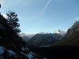
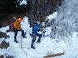
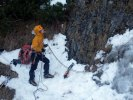

# HorecSport

> Zdroj: http://horecsport.sk/slovenske_hory/vysoke_tatry/akcie/tatry_lady2015/vt.htm — Wayback snapshot 20210227025117 (https://web.archive.org/web/20210227025117/http://horecsport.sk/slovenske_hory/vysoke_tatry/akcie/tatry_lady2015/vt.htm)

[HorecSport Home Page](index.md)

**Tatry podruhé**

**Vysoké Tatry 2015**

Všechno začíná koncem a všechno zlé je k něčemu dobré!

Tak je to v přírodě zařízené a v životě také. Zlé doby vystřídají dobré a zase naopak. Měli bychom to začít přijímat tak, jak to je a možná se sami změníme a už se nebudeme tolik trápit.

S touto myšlenkou v hlavě jsem dorazil ke konci roku 2014 za Ivuškou do Tater. Jako by mě tam něco hnalo. Jako bych měl potřebu už ukončit ten starý rok a začít nový jinak. A tak jsme i učinili a udělali jsme to po svém. Zakončili jsme ho dvěma krásnými túrami a lyžovačkou. Zakončili jsme ho novými plány a možná si i něco slíbili…

Věci se pak upekli tak rychle, že jsme po patnácti dnech zpátky v Tatrách, ale to už se píše rok 2015!

Před kola automobilu mi v poslední chvíli před odjezdem z Pelhřimova skáče kamarád Jenda se zoufalým zvoláním „Já chci do Tatér!“ a na rameni svírá své dvoumetrové kandaháry. Na otázku „Klobásky a zrcadlovku máš?“ Odpovídá „Mám“! A po chvilce se už rozjíždí náš cikánskej taxík. Naše Fábie je narvaná až po strop. Pokud bychom po cestě jen jednou prudce zabrzdili, naše hlavy nám jistě odřeže snowboardová fošna a čertovský prkýnka. Ale na to nemyslíme. Cesta ubíhá pohodově v rytmu složitých dialogů o životě. Psychiatr by si na nás jistě smlsnul. V deset večer jsme v BC v Nové Lesné. Chlapci už na nás netrpělivě čekají s drinkem na uvítanou. Podle zabarvení jejich obřích nosů je nám jasné, že až tak netrpělivé čekání to zase nebylo. Po ochutnávce domácí pálenky z oskeruše chápeme. Sestava je tedy následující - předseda, Ivuška, Jeník a já. Dlouho jsme se neviděli a tak chvilku posedíme. U rozhovoru přebalíme materiál a honem na kutě. Budíček je totiž o půl sedmé. A cíl? Bielovodská dolina.

Ranní počasí by uspokojilo spíše vášnivého mykologa. Obleva namísto slibovaného ochlazení. No co, alespoň omrkneme terén. Přejíždíme autem na parkoviště u horolezecké ubytovny v Lysé Polane. Po cestě do Bielovodskej začíná foukat teplý jarní fén. Půlka ledna a počasí jak na Jadranu. Náš cíl jsou dost nízko položené Tisovky. Adin úsmev v rozkladu, obcházíme ho. Vedle Mrozekov vypadá na poměry v dobré kondici. Jenda odchází dolinou na průzkum něco pofotit. Ivuška natahuje délku a my s předsedou se vezeme. Po slanění kufrujeme a mizíme. Je skoro poledne a začíná tu létat vzduchem. Slunce totiž, už olizuje Mrozekovi záda. Jdeme se projít Jendovi naproti. Šikovný je ten náš Jenda chlapec, chrupnul si zatím v turistickém odpočívadle na stole v klidu uprostřed doliny. Možná kdyby mu medvěd francouzáka vlepil, ani by to necítil. U auta si dáme jednu plzeň v ubytovně a poklábosíme s majitelem. Znovu u něho kontrolujeme předpověď - i na zítra hlásí teplo a to se mělo ochladit. Loučíme se a pádíme zpět do BC. Po cestě se obloha zatáhne jak pytel a prší. V Lomnici ještě navštívíme obchoďák a hurá vařit večeři. Té se k našemu velkému potěšení ujímá Jenda. Aby taky ne, je to přeci expediční kuchař. Co jsme jedli, do zprávy nejde uvést. Nedej bože by nám mohl někdo závidět a snížit klubový rozpočet.

V

Sobota ráno a my stoupáme první zubačkou na Hrebienok a dál po vzoru silvestrovské túry na (SD). Jenže oou… Trošku jsme se přepočítali, od silvestra lehce připadlo. Ne moc, ale mákneme si. Střídáme se tedy mlčky v prorážení stopy, nesouc si při tom každý svůj kříž. Opět fouká, jen oproti minule je rozdíl 15 stupňů plus. Tuším o jedenácté jsme na SD. Probíhá klasický trojboj. Půl litru čaje na recepci při sledování nekonečného filmu pana B., zakončený nejluxusnější toaletou v Tatrách. Pak padá rozhodnutí: po pravé straně „rybníka“ nad hotelem vzhůru pod Velickou stěnu. Jen tak nakoukneme do Nevěstina závoje a uvidí se. Tentokrát v dolině už nejsme sami. Naproti z Orolína již slaňují dva borci a než nastoupíme výš, už se probíjejí na odpolední směnu na Sopeľ. Hlavně klid, mají jistě jen za úkol narušit naší psychiku. Z dáli už je vidět, že náš led je úžasně vytečený a s každým krokem nahoru stoupá napětí a zároveň chuť. Už není cesty zpět! Obě délky vede Ivuška. Nástup do druhé délky vypadá od štandu otřesně. Expozice v kombinaci bočního pohledu na prvolezce mi říká „ E.T. volat domů“. Marně však, prvolezec zpátečku v plánu nemá. Vichřice pod námi tolik burácí, že zvuky jen umocňují atmosféru. Při lezení mě navštěvují sluchové halucinace v podobě právě projíždějícího vlaku, či urputného dětského kvílení. Jen povely spolulezců slyšet nejsou. Nakonec vše dobře dopadne a k na večeru sedíme u piva a horce na Sliezskom Dome. Po druhé rundě ale už mizíme. Přece jen nás ještě čeká dlouhá noční procházka. Pivo v Tivoli tentokrát nebyl ten nejlepší nápad, hold trubky by se občas čistit měly! Následuje električka a pálení žáhy. Nakonec však úspěšně zažívací problémy vyřešíme v kolibe v Nové Lesné. Kombinace několika horců a piv udělá svoje. Tam se také opět shledáváme s kamarádem Jendou, který se s námi po oběde před nástupem do roboty rozloučil a šel si svou cestou. Prý nám i dokonce stihl v BC uvařit, no a tím si nás opět získal.

Jo, ne nadarmo se říká, že láska prochází žaludkem…

Fištrón
