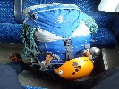
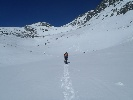
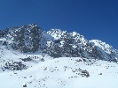

# HorecSport

> Zdroj: http://horecsport.sk/slovenske_hory/vysoke_tatry/akcie/zima%202016%20velicka/vt.htm — Wayback snapshot 20211203010221 (https://web.archive.org/web/20211203010221/http://horecsport.sk/slovenske_hory/vysoke_tatry/akcie/zima%202016%20velicka/vt.htm)

[HorecSport Home Page](index.md)

Zimná sezóna 2016

ll.časť

Noo keďže je už dosť pokročilý dátum a ja som sa konečne rozhýbal napísať zopár riadkov o klubovej lezeckej zime tak môže sa stať, že čitateľov ochudobním o dosť podstatných detailov, ktoré mám tak rád J. Vlastne ono sa to stane určite lebo som už pozabúdal čo to. Ale viem presne kde sme boli. Tak sa mi zdá, že aj predseda čosi sľuboval, že aj on prispeje do tohto článku, lebo registroval som aj jeho spoločné počiny s Horárom na rakúskej skale.

S istotou viem, že niekedy v druhej polovici marca sme sa neobvykle dohodli všetci 4 aktívni členovia klubu Horecsport na spoločnej akcií v Tatrách. Našu už pomaly nudnú predsednícku trojku doplnil aj člen Fištrón, zosadol zo svojho dopravného prostriedku, ktorý sa volá skateboard, naskočil plný síl a odhodlnia do vláčku a hybááj na Slovensko za nami. Za necelých tušim 10hod bol už aj v BC J. To my-predsedníctvo sme sa odviezli pohodlne autom. Večer sa okolo 23 dorútil Fištron asi so 100kg batohom a už len rozprával a rozprával a rozprával... a my sme mali po dlhom čase konečne nejaké kino. Spali sme už v lezeckých dvojkách aby sme si boli bližší J - Predseda-Horár, Fištrón a ja. A tak sme sa prepracovali do nasledujúceho rána a potom si až pamätám ako kráčame od Sliezskeho do Velickej doliny pod nastup na Ľad za Velickou próbou [http://www.tatry.nfo.sk/lady.php?lad=6:Velická-dolina:43a](http://www.tatry.nfo.sk/lady.php?lad=6:Velická-dolina:43a):. A to sú tie detaily, o ktorých som vás varoval, že si nebudem pamätať. Prisaámbohu neviem ako a o koľkej sme sa dostali na Sliezsky, ale to neni až také podstatné. Počasie bolo v to ráno ako vymaľované, ideálne na Tatranský výlet. Jasno a mrazivo. Všetci v dobrej nálade. A podľa toho to aj vypadalo celý deň. Vládla naozaj pohoda a prispela k tomu aj výborná kvalita ľadu (vlasne taká tatranská, tvrdý a krehký), čo urobilo z lezenia naozaj pasiu. Dve dĺžky v kompaktnom, kvalitnom ľade stáli za to. Do druhej som vyhnal Fištróna, nech sa trochu pretiahne, lebo to bol jeho prvý zimný výlet a chalanisko si to užíval J... najmä posledných 5-6metrov... no zvládol to s ľahkosťou jemu vlastnou. Ale bol to naozaj velice pekný ľad a múdre rozhodnutie ísť práve semkaj. Na Sliezkom už si nepamätám, ale asi sme si dali ved čo iné asi pivečko a v polotme k autu, večer varil kuchár Horár a robil aj DJ, čiže mixoval okrem vajíčok aj hudbu J

V noci snežilo, ráno snežilo a neprestávalo, tak reku po raňajkách, že pojme sa prejsť na Brnčalku a uvidíme tam, že čo. Nuž sme išli, ale podľa toho ako sa zmenilo počko, tak sme nemali ani nejaké veľké ambície. Ako hovoríme, že aspoň niekde trochu zaťať. Už cestou na Zelené pleso sme videli ako sa dosť rýchlo mení lavínovka, už je z toho poctivá troječka. Čiže za 3. A ako to už býva v takýchto nejasných dňoch, nič nenaponáhľame tak sme si sadli najprv na pivečko na chatu. Lebo ako Fištrón neustále opakuje múdrosť z Vysočiny(a že ich tam majú) „pivo po ránu je jako hnúj na pole“ J. Ešte lepšie dve ako jedno. Ale samozrejme z doliny neodchádzame bez toho aby sme zaťali, ešte sa prejdeme ťuknúť do cvičných ľadov nad chodníkom – vo svahoch Svišťovky [http://www.tatry.nfo.sk/lady.php?lad=3:Dolina-Bielej-vody-Kežmarskej:28](http://www.tatry.nfo.sk/lady.php?lad=3:Dolina-Bielej-vody-Kežmarskej:28): snehu stále pribúda, sneži a sneží a sneží, aj sme chvílu rozmýšlali, či neostať na Brnčalke, ale staršinovci zavelili na ústup a večer zdrhli po trochu nervóznej rozprave domov. Čo sa ukázalo ako pekná blbosť (nie vždy majú starší pravdu) lebo dalo by sa liezť aj ďalší deň, samozrejme s prihliadnutím na snehovú situáciu, ktorá sa naozaj dosť podstatne zhoršila. Nuž sme sa s Fištrónkom prešli na pivečko na Zámku a dosť sme druhú lezeckú dvojku aj ohovárali, ale veci s klubovej kabíny sa nevynášajú J.

Ivík
