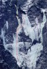
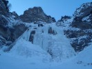
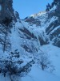

# HorecSport

> Zdroj: http://horecsport.sk/slovenske_hory/vysoke_tatry/akcie/zimne_radovanky_2017/vt.html — Wayback snapshot 20220308014407 (https://web.archive.org/web/20220308014407/http://horecsport.sk/slovenske_hory/vysoke_tatry/akcie/zimne_radovanky_2017/vt.html)

[HorecSport Home Page](index.md)

**ZIMNÉ RADOVÁNKY** **2017**

**Zastavenie** **prvé**

Nuž rok sa s rokom stretol, ani sme sa ani nenazdali a potichúčky sa vkradla do naších životov nová zimná sezóna. Medzi sviatkami udrela zima v plnej svojej sile a kráse. Napadlo snehu v Tatrách a v blízkom Rakúsku a nepusila nás zo svojho mrazivého zovretia až do konca januára. Krása. Radosť niečo vymýšlať. No my sme až tak nevymýšlali, lebo sú ísté výzvy, ktoré sú už vymyslené, sú v naších hlavách, len ich treba pri vhodných podmienkach zrealizovať. Jedna taká z výziev je a vždy bude tiesňava Hintere Tormäuer v rakúskom Erlaufboden. A tam náš obľúbený Bluebox. Mrzlo statne už zopár dní – takmer dva týždne, mráz nepovolil tak čo už nebolo čo váhať. Písala sa bežná streda 11.1, na Malvínu, šup ho do auta s Horárom a tradá do Tormäuer-u. Teda snehu pribúdalo cestou, až sme po prekročení Annabergu zistili, že toho snehu zase až toľko byť nemuselo J. Zrazu také slabé šimorenie v tele som mal( neviem presne kde, ale bolo). Parkovisko. Nikto nikde, len nepatrná už zasypaná stopa do tiesňavy. Fíííha, to tu dávno nebolo. I tak predierame sa, krok za krokom snehom tiesňavou ponad potok, až k oblasti Blue box. Nikde ani živáčka, občas vidieť v potoku pstruha.., toť vše. Dnes sami v celej tiesňave. Úžasné. Poslednú zmienku o lezení v oblasti som zaregistroval pred pár dňami, kedy sa dvom lezcom pri zlaňovaní Deep Blue seklo lano a museli ich spúšťaž záchranári. Kam len oko dovidí samý ľad a množstvo snehu. Na úvod, na rozlezenie a rozcvičku, naše oko dovidelo na ľahší ľad - Blaumax WI 3-4, 40m. Ok pretiahnutí sme, tak sa ide teda na tažšie sústo. Nech nechodíme ďaleko, tak reku Blauer Montag WI 5-, 110m. A to už bolo z iného súdka. Tá prvá dĺžka naozaj dosť do kopca. Mráz zachádzal pod nechty, ak si dobre pamätám, tušim som aj ponadával čosik a tak J. Ale šak nejako to išlo, atmosféra bola, no čo vám poviem aká. No taká ako ked ste v takom kolorite s kamarátom sami, leziete ťažkú vec a docela vám to ide. Nervy vycukané, všetky zmysly totálne zapojené, počujete aj vločku padať, aj pstruhov v potoku sa rozprávať, absolútne koncentrovaní, pohrúžení do práce. Veď to poznajú mnohí. Povedal by som, že opojná atmosféra, ba až návyková. Ok zlaníme pod ľad, fuška za nami, kuknem na hodiny. Ukazujú tušim okolo 14,30. Hovorím si ok na dnes stačilo, dni sú krátke, po pol 4 sa začína stmievať. Horár na mna kukne i vyrečie s úškrnom túto vetu: „Ivuško posilníme sa, zobereme čelovky a ideme do Deep Blue“. Kua, asi som zle rozumel, alebo Horár totálne zošalel, šak to je na celý den roboty mu hovorím. A on, že šak neboj nič, iba prvú dĺžku, aby sme si to nacvičili J. Toto som fakt nechcel počuť. My sme si to tam totiž už raz nacvičovali a taký Ľubo by mohol rozprávať... O pár minút neskôr, posilnený krowkami a hltom čaju sa už aj drbeme k Deep Blue po pás v snehu. Čelovka v bundeJ. Ale naozaj sme dali iba prvú dĺžku a na Abalakoch zlanili už v podvečernom akože vo svetle. Pobalíme a tíško, tak ako sme sem ráno prišli, tak aj odchádzame, aby si nás nikto nevšimol. Pri aute je už úplná tma.. Cestou sa stavíme v ľudoprázdnom Annabergu v Gasthofe na kávičku. Sedíme pri stole ako obyčajne a triedime myšlienky.. No to bol teda deň.. J

Z

**Zastavenie druhé**

O týždeň neskôr, 19.1. štvrtok ráno, autom idem tentokrát ja, môj spolujazdec, kto iný ako Horár. Smer Hintere Tormäuer. Teplomer ukazuje permanentne okolo mínus 8 až 10. Nacvičené je a ideme už na istotu, ani sa nebavíme kam, je to jasné, dnes bude zábava v Deep Blue. [http://www.bergsteigen.com/eisfall/niederoesterreich/tuernitzer-alpen/deep-blue](http://www.bergsteigen.com/eisfall/niederoesterreich/tuernitzer-alpen/deep-blue), WI 4-5, 150m, Prichádzame na parkovisko a teplomer ukazuje -14, ale sme pripravení, rozložime karimatku a na nej postávame bosý a navliekame sa do všetkého možného. Základ je byť pri týchto teplotách sakra rýchly, lebo prsty omznú velice friško. Tak teda makáme, prezlečieme, ešte niečo dzobneme na raňajky, dúšok, dva horúceho čaju a ideme do tiesňavy. Dnes sme tu už neni sami. Sú tu zaparkované aj 2autá miesnych alpinistov. Ale to je počet, ktorý naozaj riešiť nemusíme. Kým tu nie sú po 3 autá maďarov a čechov je to ok J. Po vstupe do tiesňavy zisťujeme, že snehu je viac ako pred týždňom. Naozaj dosť.. Naše kroky vedú do Blue boxu. Vidíme, že v Deep Blue už jedna dvojka visí, ale to nehrá rolu, začínajú liezť druhú dĺžku, kým prídeme, ustrojíme sa tak už budu v tretej, no a ľad z tretej dĺžky padá mimo naš štand. Na nástupe ani moc neotáľame, lebo zima je naozaj riadna, takže časové prestoje v tej kose nie sú žiadúce J. Prvá dĺžka ľahšia, nacvičená, štand na Abalakoch, v druhej už človek začína cítiť expozíciu, štand v parádnych nitoch. V tretej nepríjemný traverz doprava na takom čudnom dunivom sneho ľade, štand v Abalakoch nad snehovou policou, na ktorú keď Horár stúpil vydávala nie zrovna pre ľudské ucho, v tom danom čase a priestore, príťažlivé zvuky J. Doleziem k Horárovi na štand. Trochu v rozpačitom stave z toho traverzu. A tak si sám pre seba tušim zamrmlem niečo také akože na akej pi.....e to stojíme a čakáme kým sa to celé uj..e a poletíme dole ako dvaja surfisti na doske. Horár sa s kľudom, ako vždy uškrnie a povie, pozri dole. Kuknem a čo nevidím. Rakúsky turbo alpinista si to valí po spomínanej snehovej polici, na ktorej akože stojíme. A priamo k nám. Blázon, ale podľa jeho pohybov a budovania štandu meter vpravo od nás, to bol ťažký profík. Zdravíme sa a krátka debatka. Zatiaľ Horár nastúpil do 4 dĺžky, najprv kolmý úsek ľadu, potom strmým, hlbokým snehom cez kosku ku stromu, na ktorom štandujeme. O pár minút sú za nami aj miestni alpinisti, pozeráme odkiaľ zlaniť, vľavo od nás stále visí už spomenuté seknuté lano dvoch smoliarov spred 2týždňov. Je nám jasné prečo sa seklo, hodili ho okolo kmeňa stromu, akurát, že príliš kolmo išlo nadol a zarylo sa, potom ho už nestiahne nikto. Teraz si tam opustené visí a je krásne zaliate v ľade ako výstraha pre ďalšie pokolenia J. My sa tejto chybe vyvarujeme a lano zakladáme okolo konára „nášho“ stromu. Raz dva zlaníme a už stojíme na tej nepríjemnej snehovej polici cvaknutí v Abalakoch. Zlaňovať ešte nebudeme, ale traverzneme nahor do riadneho štandu cez Bluebart WI4, 40m. Odtiaľ na 2x zlaňák až pod nástup, stiahneme laná, vybalíme svačinu a pod ľadom zapíjame jedlo horúcim čajom. Krásne sa postupne rozohrieva telo po celodennej mrazivej fuške. Pobalíme a naspäť už nesieme batohy tri. Každý ten svoj a ešte tretí – po rokoch zvesený z Deep Blue. Na parkovisku meníme kontakty v záujme výmeny fotos s tými dvoma miestnymi lezcami, ktorí nás kopírovali celý deň no a kafé v Annabergu skrátka muselo byť..

**Zastavenie tretie**

Vietor sa obracia a my smer Tatry. Niekedy koncom januára. Tentokrát zohratá horcová trojka už aj s Predsedom. Večer v BC vyhutujeme kam na druhý deň – na môj vkus až moc. Ano, nie, kam, prečo, podmienky, počasie, teplota, tlak, rosný bod, na dobrodružstvo v odľahlejšej doline to ešte nebude, je stále dosť snehu na presun niekde ďalej. Po nekonečnej debate, pri ktorej predseda zje asi 20 cukríkov! si tľapneme na Zlomiskách, reku že nakŕkneme do Tupej. Konkrétne do cesty Tupá Fiesta. Cesta ako pre nás, ešte aj spestrená ľadovým úsekom. Parádička. Na papieri... Ráno sa stavíme na Popradskom plese, na čaj a kafe. Na stole nás čakajú raňajky. Akože neni problém J. Vyrážame do Zlomísk, na chate a v doline sa mi zdá byť dosť skialpinistov, to sú tí zlí ujovia a tety, čo podľa ochranárov a markízy počas zjazdu príležitostne podrezávajú nepozorných svišťov a kamzíkov ostrými hranami lyží.. J. Ako si tak vykračujeme dolinou tak sa nám zdá, že veru v stene moc toho ľadu nieto. Vlastne žiadny. Suchá stena. Až zájdeme do zadného traktu a vidíme to isté, ako v prednom. Suchú stenu. No na Tupú fiestu to dnes nebude. Tak zvažujeme čo teda a kam teda. Ked sme už tu, čas pokročilý, nemá význam sa presúvať niekam ďalej. V žľabe si niečo nájdeme. Najbližší žľab je ten posledný-no nič šup do neho. [http://www.tatry.nfo.sk/cesta.php?obr=stity//0936//09361001.p](http://www.tatry.nfo.sk/cesta.php?obr=stity//0936//09361001.p). V žľabe je nasadaného docela dosť snehu, takže nič moc to neni, spestrením je balvan zakliesnený v žľabe. Jeho oblezenie spôsobuje najväčšiu radosť Predsedovi a zdá sa, že si to konečne užíva J. Bolo to tužim sedem dĺžok, ale také lepšie boli len posledné dve, lebo predsa len do dolnej časti žľabu slnko nezasvieti a bola tam nechutná hlboká snehová krupica. To hore bol už sneh pomocou slnka podstatne lepší, pretvorený,tvrdý a miestami až ľadovo. Ale šak dobre celkom to bolo, nakrajšia časť dňa nás čakala aj tak po dolezní. Výlez je v zadnej časti Tupej – t.z. bližšie k Lúčnemu sedlu. Pri mäknúcom podvečernom slnku sme sa rozhodli schádzať výhodnejšou a krajšou zostupovkou, cez Lúčne s.a Zlomiská a nie cez vrchol a Ostrvu. Každý ideme sám a kúpeme sa v posledných slnečných lúčoch zapadajúceho červeného slnka. Výhľady na Želenú bránu, Zlobivú, Rumaňák, Ganek a Vysokú sú odmenou za lopotu v hlbokej snehovej krupici. Ideme pomaly, s takejto atmosféry sa neponáhla. Pivečko na Popradskom sadne a tmavým lesom fičíme k autu. A nikto ani nepadol J

**Zastavenie štvrté**

Plán bol jasný. Stokom vody Stredohrot, alebo SZ stena Slávkovskej kopy. Keď som bol v Tatrách cez sviatky videl som ako sa parádne vytváral komplet súvislý ľad. Okrem prvej dĺžky perfiš vyladnené, taký som ho ešte nevidel (asi chodím málo do Tatier). Tak reku celý január tuhlo až sa psy lámali v zákrutách tak ideme na istotu. Omyl. Stok vody takmer neexistoval.. Toto sú tie nádherné zvláštnosti a paradoxy Tatier. Nič nie je isté J. Ale je to tak pol na pol - sú aj milé prekvapenia aj tie horšie. SZ stena Slavkovskej kopy tiež bez snehu a ľad ani náhodou. Už sme vo Veľkej studenej, tak ostávajú dve možnosti, keďže sme traja a do ničoho veľkého a dlhého sa pustiť nemôžeme. Takže buď sa na to vyprdneme a zájdeme na Zbojníčku na pivo alebo pojdeme ako vyriekol Horár „zhora dole“ Groszov ľad, Veverkáč a Záhradky. Druhá verzia vyhrala, keďže sme už ten športový klub J. A ísť na pivo by znamenalo zostať v Tatrách do zajtra a to nechceme, lebo šak aj do roboty treba nakŕknuť. J

**Zastavenie piate**

Už sa nám zazdalo, že je čas na nejakú riadnu jarnú klasiku, skôr monument Jpovedané Saganovskou terminológiou. A tiež sa nám zazdalo, že snehu je už menej a bude sa možné prejsť aj niekam ďalej.. A veruže bolo to ďalej. Tentokrát sme sa v BC dlho nevybavovali s rozhodnutím kam vyrazíme. Dosť jednoznačne vyhrala Hlinská dolina. Ufffff. Predchádzala tomu moja choroba, v ktorej som sa v tej chvíli ešte jednou nohou nachádzal a tiež prebdená noc, keď som nezažmúril ani oka. Večer si hovorím, reku dám si niečo na moju večne seknutú krčnú chrbticu. Budem otrtúlený a dobre sa vyspím pred dlhým nasledujúcim dňom. Lentilku som síce požil, radšej dve, ale zapil som to ako som na druhý den večer prečítal skvelým alpským sypaným čajom Energy Tea. Tak ak chce niekto skúsiť nejaký pokus na sebe, že ako sa chová jeho telo tak odporúčam. Dozvie sa viac. Ak to ustojí. Dať si niečo na spanie a zapiť energy nápojom. Fakt som myslel, že to je moja posledná noc. Hovorím si „a je to tu“. Prichádza môj koniec. Asi porážka. Tá prichádza nad ránom. Čas a pocity, všetko sedí. Horár si vedľa mňa veselo pochrapkával a ja som hľadiac do stropu stríhal pomyselný meter. Ale šak aspoň si chlapci zajtra zalezú bezo mňa a večer nahlásia, že je po mne. No, ale osud nebol ku mne milostivý a doprial mi vstať ráno z postele a vyraziť do niečoho naozaj úchylného. V chorobe, totál nevyspatý do Hlinskej. Minimálne 4hodky na nástup! Skoré ráno, Tri studničky, tu nás čaká jedna z dvoch postavičiek, ktorú sme v ten den stretli. Druhú aj na polceste do Kôprovskej nejaký tušim ochranár, alebo taká nejaká typa. Na dlhú cestu nás odprevádza ranným oparom obalený, Kriváň. Vykračujúc hore Kôprovskou dolinou zisťujeme dva zásadné poznatky. Prvý je ten, že toho snehu zase až tak málo nie je a bude to drina až do večera prešľapávať hore dole. Každých pár sto metrov snehu po centrimetríku pribúda. Druhý poznatok je ten, že medvede sa už zobudili..., čiže nie moc dobré news. Na druhej strane jedna dobrá, ktorá prebije obe zlé. Je totiž krásne mrazivé, slnečné ráno. A dokonca sa aj nejako zobúdzam hoci som raňajšiu kávu radšej neriskoval, aby mi nevyskočilo hned po ránu srdce z hrude. A tak si ideme, ideme, aj sme si už zvykli na medvedie stopy v snehu, ukrajujeme meter za metrom aj občas prehodíme dve tri vety. Predseda vraví, že sa teší na taký mäkký jarný ladík „vieš taký ako masielko“, až sme sa ocitli na rázcestí pod Hlinskou dolinou. I rozhliadam sa okolo seba a niečo je iné.., aaaa už to mám! Veď tu je všetko akési až moc biele = dosť snehu. No darmo odľahlá oblasť.. A už aj vstupujeme do doliny po stopách vlka, ktorý razil stopu ráno. Tu už vidím, že so snehom to bude dosť zábavné. O nejakom jarnom úbytku alebo nedajbože prichádzajúcej jari nemôže byť ani reči. Vládne tu tuhá zima. Pohľad do zadnejších partíí doliny hovorí, že je tam aj zbytočné sa brodiť, lebo oba ľady do Veľkej záhradky sú pod snehom. Ale radšej by sme dali nejakú cestičku.. Takže sú tu dve možnosti takto skraja doliny. Buď ľadopádom do Prednej Garajovej lávky http://www.tatry.nfo.sk/lady.php?lad=9:Hlinská dolina:47c:, alebo druhá verzia http://www.tatry.nfo.sk/lady.php?lad=9:Hlinská dolina:47e:. Druhá vyhrala len z jediného dôvodu. Sme tu traja a hoci sme dosť rýchli, tak toto by bolo dosť na dlho a dni sú predsa len ešte neni také dlhé. Ale aj Ľadopád v stene pod Hrubou Kopou je v podstate fajn vecička – taká na nás šitá, snehovo mixový výstup spestrený lezením v ľade. Parádička. Ideme do toho. Ako trojka sme dosť zohratý team a časové prestoje moc nemáme, každý má svoju rolu a presne vie čo a ako. Nuž sa predierame hlbokým snehom v žľabe ako snehové frézy a občasný pohľad dole hovorí, že naberáme výšku. Popis cesty sedí a v 4 a 5 dĺžke na nás čaká ľadopád. Očekujeme ho a nejako nám nepripadá na pohľad nejak zvlášť ťažký. Hodnotenie sedí 4+ 5-. Horár už začal búchať prvé metre a kukám na to, že čosi neni v normále. Nejako pomaly ukrajuje z dĺžky. A veru nebolo. Ľad bol totálne tvrdý ako betónový panel, kua. Ešte aj svojou odľahlosťou absolútne panenský a nepošlapaný, čiže bez akýchkoľvek známok úderov od mačiek či čakanov, od predchádzajúcich lezcov. Aj Horár mal čo robiť kým sa cez to pevrtal, ale šak jasne, že to dal, len bojoval viac ako inokedy. Dal aj Predseda, aj ja a musím povedať, že to bol pre mňa osobne jeden z najťažších ľadov v Tatrách. Svojou neskutočnou tvrdosťou. Po ľade obtiažnosti „ako masielko“ ani stopy. Po prvej dĺžke cítim, že ruky mám vyťahané a predlaktia ako Pepek námorník. Druhá bola o čosi ľahšia, až nasledovalo po výleze z ľadu traverzovanie snehového poľa doprava na skalné rebierko. To bola zároveň aj posledná dĺžka, ale nie najľahšia. Ešte sme veru museli zabojovať, tu bolo naozaj dosť nasadaného snehu,krupice, miestami po pás v docela strmom teréne, krok vpred, a pol kroka vzad a meter do hĺbky. To bol nie moc estetický štýl, ale srať na estetiku podstatne je sa predrbať na skalu a doliezť to. Veď nás hádam Kubala a Trubala nevidia ani nesledujú kamerami z nejakej kosky J. Stojíme na skalnom výbežku, akože hrebienčeku a kukáme na druhú stranu dole. Pod sebou dosť strmý svah, asi nejaké trávy ale ozaj dosť strmé na tom to množstvo snehu a vôbec to nevypadá ako bezstarostná zostupovka. Trávy pokračujú do lavínového žľabu, ktorý vlastne pri svojom sklone proti trávam vypadá ako brnkačka. Zostávame z cvičných dôvodov radšej naviazaní. O pol 6 stojíme dole v Garajovej poľane pod žľabom. Je dobojované. Konečne čas na čaj, sladkosti a klobku, ktorú nosím v batohu od rána. Ochotne sa s ňou podelím s kamarátmi, keď si spomeniem na raňajšiu medvediu stopu v snehu. I vyzývam ich ku kolektívnej súdržnosti cestou dole. V skratke, aby dole neutekali ako s nasoleným zadkom lebo aj my pomalší, sa chceme vrátiť domov bez zbytočnej bitky od medveďa J. Cestu tmavým chodníkom až na Tri studničky preruší neuveriteľne veľká medvedia tľapa na chodníku ešte nad Kmeťákom. Tu prestáva sranda. Zrýchlujeme tempo J. Docela sa schladilo...

**Zastavenie šieste**

Na druhý deň po akcíí v Hlinskej. Ráno vstaneme o 6, ale ani neviem prečo, ale ked je človek unavený až moc tak ani nespí poriadne.. Ja som zrelý na infúzky. Aj sa čudujem, že to moje telo v chorobe a po prebdenej noci zvádlo. A to som si myslel, že poznám svoje limity. Opačné zistenie by bolo trochu nepríjemné J. Sľúbený hemenex od Predsedu sa nekoná - nemáme vajíčka. Ale máme chuť na pivo a tá sa neodkladá. Po nejakom čase sa chlapci už začínajú cítiť, pobalia sa a plánujú dnes zavŕšiť obľúbenú dvojkombináciu. Hlinská –Šašo. Idem ich odprevadiť do Veľkej studenej. Je tušim nejaký pracovný deň v týždni, takže nestretáme cestou nikoho, nicméne ľadové podmienky v doline sú na jednotku. Idú do Šašovho ľadu [http://www.tatry.nfo.sk/lady.php?lad=5:Veľká-Studená-dolina:39c](http://www.tatry.nfo.sk/lady.php?lad=5:Veľká-Studená-dolina:39c): Možno sa Predsedovi splní dnes aj sen o mäkkom ľade. „vieš taký ako masielko“ J.

Horcu zdar!

Ivík
